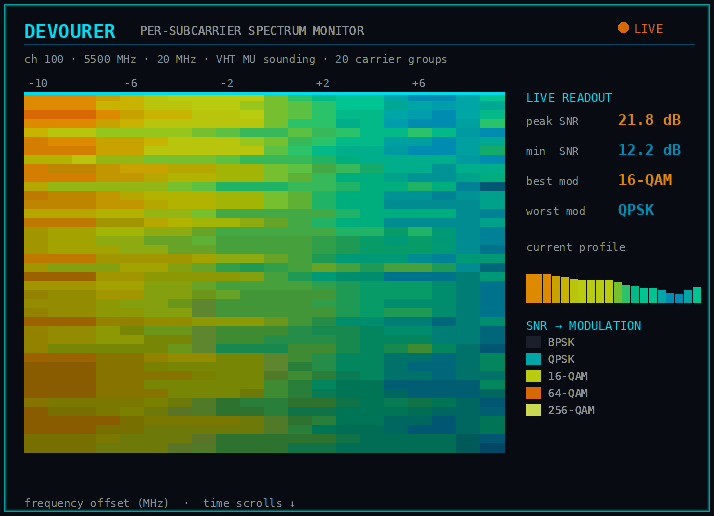

# Beamforming self-sounding — per-subcarrier CSI from two adapters



*Live per-subcarrier SNR waterfall from an 8822CU MU self-sounding session
(`tests/bf_waterfall.sh` → `tools/bf_waterfall.py`; the animation is
`tools/bf_waterfall_gif.py` over a real capture): frequency across, time
scrolling down, colour = the per-tone SNR and the modulation a rate-adaptive
link would pick on each subcarrier. The frequency-selective tilt is real
measured channel — 16-QAM on the stronger low-frequency tones, QPSK on the
weaker high-frequency ones.*

802.11ac beamforming sounding leaks per-subcarrier channel state: a beamformee
estimates the channel matrix H(k) per subcarrier from a sounding NDP, compresses
the steering matrix V(k) into Givens angles, and **transmits it back over the
air** as a VHT Compressed Beamforming report. On Jaguar-1 silicon that pipeline
is hardware-terminated — a chip cannot read back its own estimate — but the
report is addressed to the *beamformer*, so a second adapter (or a monitor RX)
captures it. With devourer driving both ends of the link, we sound our own
channel on demand and recover per-subcarrier CSI the chip otherwise hides.

## The exchange

```
beamformer (adapter A)                     beamformee (adapter B)
  ── NDPA (control frame) ───────────────▶   matches its own addr as RA
  ── NDP  (HW-generated) ────────────────▶   estimates H(k) from VHT-LTFs,
                                              SVD → V(k), compresses to angles
  ◀── VHT Compressed Beamforming report ──   (Action No-Ack, over the air)
```

Two hardware facts made this work, both validated on real silicon:

- The NDP is **hardware-generated**: marking the injected NDPA in the TX
  descriptor is not enough on its own — the MAC sounding engine must be armed
  first, or no NDP follows.
- The beamformee responds **without any association**: arming the responder
  registers with the beamformer's MAC (address match only, P_AID = 0) is
  sufficient; no CAM/macid entry is needed.

## Register recipe

All register values are in the generation-shared `src/BeamformingSounder.h`,
transcribed from the vendor beamformee-entry functions — Jaguar-1
`hal_txbf_jaguar_enter()` (`reference/rtl8812au/hal/phydm/txbf/haltxbfjaguar.c`),
Jaguar-2/3 `hal_txbf_8822b_enter()` (`haltxbf8822b.c`, byte-identical between
the rtl88x2bu and rtl88x2cu trees). Entry 0, P_AID 0.

- **Beamformer (`arm_sounder`)**: `REG_SND_PTCL_CTRL` enable, NDP standby
  timeout, `REG_TXBF_CTRL` NDPA-transmit enables, `REG_BFMEE_SEL` entry select.
- **Beamformee (`arm_beamformee`)**: `REG_SND_PTCL_CTRL` enable, standby
  timeout, `REG_BFMER0_INFO` = beamformer MAC (matched against the NDPA TA),
  `REG_CSI_RPT_PARAM_BW20/40/80` + BB CSI-content = report matrix dimensions.
- **NDPA descriptor (`mark_ndpa_descriptor`)**: TX-desc NDPA bit, no HW
  sequence, unicast, use-header NAV, no rate fallback.

## Driving it (demo env vars)

```sh
# beamformee: arm to reply to sounding from the beamformer MAC (no association)
DEVOURER_VID=0x2357 DEVOURER_PID=0x0120 DEVOURER_CHANNEL=100 \
  DEVOURER_BF_ARM_BFEE=<beamformer-mac> rxdemo

# beamformer: inject an NDPA to the beamformee, arm the sounding engine
DEVOURER_PID=0x8812 DEVOURER_CHANNEL=100 DEVOURER_TX_RATE=VHT2SS_MCS0 \
  DEVOURER_TX_NDPA_RA=<beamformee-mac> DEVOURER_TX_NDPA=1 \
  DEVOURER_BF_ARM_SOUNDER=1 txdemo

# capture + decode the reports (any monitor RX; the beamformer is addressed but
# monitor mode is promiscuous). Mode 4 dumps full frames for the decoder.
DEVOURER_PID=0x8813 DEVOURER_CHANNEL=100 DEVOURER_BF_DETECT_REPORT=4 \
  rxdemo | tools/bf_report_decode.py

# single-radio beamformer: the report is addressed TO the sounder, so one
# adapter can sound and capture its own reports — DEVOURER_TX_WITH_RX=thread
# runs the RX worker loop on a thread next to the TX loop (one bring-up, one
# claimed handle; see StartRxLoop in IRtlDevice). Hardware-validated on the
# 8814AU (Jaguar-1), the 8822BU (Jaguar-2) and both Jaguar-3 variants
# (8822CU / 8822EU) — 50k+ self-captured reports per 20 s at full sounding
# rate. On Jaguar-2/3, DEVOURER_BF_ARM_SOUNDER takes the sounder MAC
# (programs the self-MAC 0x610).
DEVOURER_PID=0x8812 DEVOURER_CHANNEL=100 DEVOURER_TX_RATE=VHT2SS_MCS0 \
  DEVOURER_TX_NDPA_RA=<beamformee-mac> DEVOURER_TX_NDPA=1 \
  DEVOURER_BF_ARM_SOUNDER=1 DEVOURER_TX_WITH_RX=thread \
  DEVOURER_BF_DETECT_REPORT=4 txdemo | tools/bf_report_decode.py
```

Gotchas that cost time during bring-up:

- CSI reports are **Action No-Ack** (FC subtype `0xE0`), not Action (`0xD0`).
  A detector matching only `0xD0` sees zero frames.
- The report frames are VHT PPDUs; a weak sniffer link drops them on FCS.

## The report format (measured, 2×1 case)

For a 2-antenna beamformer sounding a 1-antenna beamformee, each report is a
99-byte frame carrying, after the 24-byte MAC header:

| field | bytes | value seen |
|---|---|---|
| Category / VHT Action | 24–25 | `0x15` / `0x00` |
| VHT MIMO Control | 26–28 | Nc=1, Nr=2, BW=20 MHz, Ng=1, codebook=1, SU |
| Avg SNR (per column) | 29 | int8, dB = 22 + 0.25·v |
| Compressed angles | 30–94 | 65 B = 520 bits |
| FCS | 95–98 | |

The angle payload is **52 subcarriers × 10 bits** = 1 φ (6 bits) + 1 ψ (4 bits)
per tone — a *compact* codebook, narrower than the textbook VHT SU sizes
(7/5 or 9/7). The φ = ψ+2 relationship matches the standard Givens structure.
`tools/bf_report_decode.py` reconstructs the per-subcarrier 2×1 steering
vector V(k) = [cos ψ_k, e^{jφ_k} sin ψ_k], i.e. the relative per-tone channel
|h_B(k)/h_A(k)| = tan ψ_k and arg = φ_k between the beamformer's two antennas.

Decode validation: cross-frame variance of ψ(k) over 200 over-air reports is
~0.0014 rad² (~2°) — the reports are repeatable; the LSB-first bit order is
confirmed by an MSB-first control blowing the variance up ~70×. On a short LOS
bench link the channel is flat across 20 MHz (coherence bandwidth exceeds the
channel), so per-tone structure is quantisation-limited; a wider bandwidth or a
multipath geometry is needed to exercise real frequency selectivity.

## MU report — per-subcarrier SNR

An **SU** report carries only the per-tone steering direction plus a per-stream
*scalar* SNR. An **MU** report additionally appends the *MU Exclusive
Beamforming Report* — genuine per-subcarrier SNR. Arm the beamformee for MU with
`DEVOURER_BF_ARM_BFEE_MU=1` and set the NDPA MU feedback bit with
`DEVOURER_TX_NDPA_MU=1`; `arm_beamformee_mu()` layers the MU group-table
registers (`0x14C0`/`0x14C4`/`0x14C8`/`0x14CC`, entry `0x1684`) on top of the SU
responder base, programming the group/user-position directly so no over-the-air
Group ID Management handshake is needed (recipe from `hal_txbf_8822b_enter()`).

The MU report is longer (e.g. 153 vs 99 bytes for a 20 MHz 2×1). After the
V-angle field, Realtek packs the SNR as 8-bit values in pairs; **series A** (the
even bytes) is the per-tone SNR that swings with the channel. `bf_report_decode`
extracts it, maps it to dB (**unsigned**, `-10 + 0.25·v` — the per-tone values
cross 128, so a signed reading would wrap the *stronger* tones to negative) and
to a modulation per tone (256-QAM ≥ 30 dB … QPSK ≥ 11 dB), trimming devourer's
trailing chip-FCS/RX bytes at the point the smooth SNR series collapses. A
measured bench capture gives a realistic ~13–21 dB per-tone SNR with an ~8 dB
frequency-selective swing — 16-QAM on the stronger tones, QPSK on the weaker.
`--operating-snr N` optionally re-centres the measured shape to a stated link
budget. `tools/bf_waterfall.py` renders the same per-tone SNR live as a
scrolling truecolor spectrogram (see the waterfall above).
