# A visual primer on the driver machinery

This page is the decoder ring for the *silicon and software* inside a Realtek
Wi-Fi chip: what is actually in the package, and what the vendor-driver
vocabulary means — firmware, efuse, FWDL, DMAC/CMAC, halbb/halrf, LSSI, IQK,
H2C, DIG. If you've ever opened a Realtek vendor tree and bounced off ten
thousand files of alphabet soup, start here. Its sibling, the
[RF primer](rf-primer.md), shows what the *radio physics* looks like —
subcarriers, constellations, gain control. Like the RF primer this is a
picture book: thirteen short animations in the DEVOURER live-monitor style,
ordered from the silicon up. Read it top to bottom and both the vendor trees
and devourer's `src/` will read like prose.

Everything here is grounded in the vendor reference drivers vendored under
`reference/` (`rtl8812au` → `rtl88x2bu`/`rtl88x2cu`/`rtl88x2eu`), in Realtek's
Wi-Fi 6 "G6" trees of the same lineage (`rtl8852bu` and kin), and in devourer's
own re-implementations of the same machinery (`src/jaguar1..3`), so every
concept has code you can go read.

## 1. Anatomy of a Wi-Fi chip

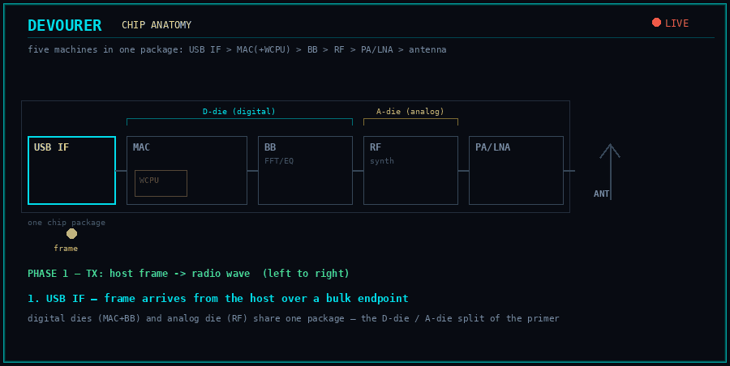

A USB Wi-Fi dongle is one chip with five machines inside, chained like an assembly
line. The **USB interface** talks to your host. The **MAC** (medium access
controller) owns frames — queues, ACKs, timers, filtering — and embeds a small
CPU, the **WCPU**, that runs the chip's own **firmware** (§5). The **BB**
(baseband) is the digital half of the PHY: the OFDM modem from the
[RF primer §3](rf-primer.md) cast in silicon — FFTs, equalizers, AGC. The **RF**
section is the analog half: a frequency **synthesizer**, mixers, and analog
gain stages that move the baseband signal to channel frequency. Finally the front
end: a **PA** (power amplifier) that gives the TX signal its final watts and an
**LNA** (low-noise amplifier) that gives the faint RX signal its first clean boost —
often external parts, which is why boards with the same chip differ (§3).

One packaging detail earns its keep later: the digital machinery and the analog
machinery are frequently separate silicon **dies** in one package — the **D-die**
(digital: MAC, BB) and the **A-die** (analog: RF). On the Wi-Fi 6 parts the split is
visible to software: some RF registers live on each die and are reached by different
paths (§9).

## 2. Registers — the only lever the host has

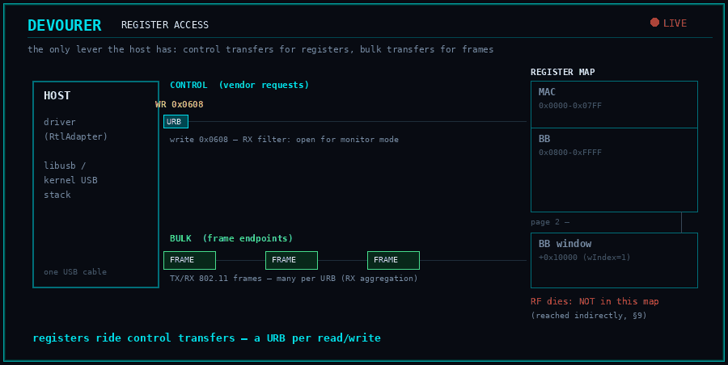

Strip away every abstraction and a driver does exactly two things: it moves
**frames** over bulk endpoints, and it reads/writes **registers** — 8/16/32-bit
cells at fixed addresses that *are* the chip's knobs and dials. On USB a register
access is a vendor **control transfer**: the host submits a **URB** (USB request
block) to the kernel's USB stack, the request crosses the wire with the register
address packed into its setup fields, and the chip answers with the data. That's
the whole trick — `lsusb`-level plumbing, no kernel driver magic. devourer's
`RtlAdapter` (`src/RtlTransport.h`) is nothing but this, and the vendor equivalent
is `usb_ops_linux.c` in each tree.

The address space is a map you'll internalize fast: the MAC's registers occupy the
low 16-bit space (power control at 0x0000-0x00FF, queues, filters), and the BB's
registers sit above 0x800. The RF dies are *not* in this map at all — reaching them
takes an indirection covered in §9. On the Wi-Fi 6 chips the BB outgrew 16 bits of
address, so control transfers carry a page selector: BB/RF accesses go through a
second 64 KiB window at `addr + 0x10000` (the high half rides the request's
`wIndex` field).

Two planes, then: control transfers for registers, bulk transfers for frames.
Every animation that follows is ultimately made of these two arrows.

## 3. One driver, many chips — chip id, cut, RFE

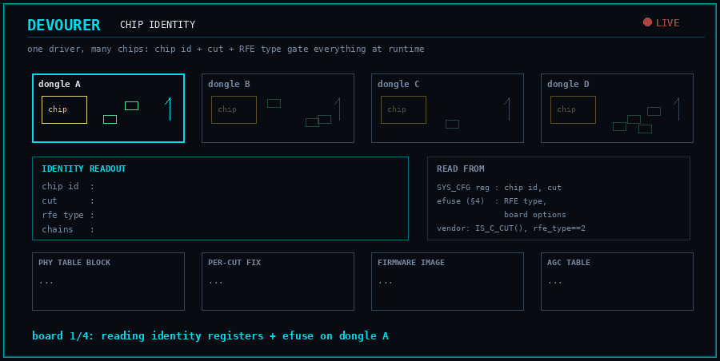

Open any vendor function and you'll find it braided with conditionals. That's
because one driver binary serves an entire family of boards, and it learns *which*
board at runtime by reading identity registers and the efuse (§4):

- **chip id** — which die design this is. Classically a field in `SYS_CFG`
  (devourer dispatches its per-generation HALs from it); on the Wi-Fi 6 parts the
  same offset means something else entirely, so a driver must dispatch those
  from the USB product ID first.
- **cut** — the silicon revision (A-cut, B-cut, C-cut…). Bug fixes between cuts
  change register defaults and calibration recipes, so init tables carry per-cut
  entries (§8) and firmware ships per-cut images (§5).
- **RFE type** — the *RF front end* wiring of this particular board: which PA/LNA
  parts, antenna switches, and band paths the vendor soldered around the chip.
  Read from efuse, it selects between whole alternative blocks of the PHY tables.
- plus package type, TX/RX chain count, and interface — all feeding the same
  gating machinery.

devourer bottles this identity into one context object
(`JaguarPhyContext` in `src/PhyTableLoader.h`) and hands it to the table walker in
§8. When you see vendor code asking `IS_C_CUT(...)` or `rfe_type == 2`, this is
what's being asked: *which exact board am I standing on?*

## 4. efuse — the chip's birth certificate

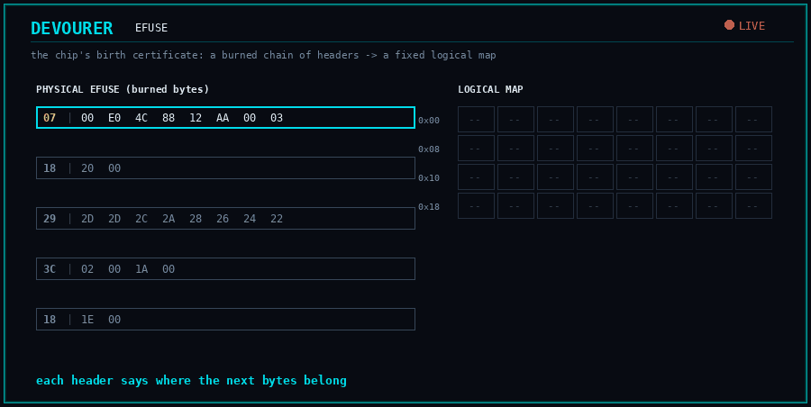

The **efuse** is a small one-time-programmable memory burned at the factory —
the only per-unit data the chip carries. In it: the MAC address, the crystal
trim (each 40 MHz crystal is slightly off; the trim recenters it), the per-rate
**TX power base** values this unit was calibrated to, the thermal-meter baseline
(§11), the RFE type (§3), and a scatter of board options.

The catch is the format. The burned bytes are not a flat structure but a compact
**physical map**: a chain of headers, each saying "the next few bytes belong at
logical offset N, and only these words of it are present". Fusing works one way —
0→1 bits only — so updates are burned as *additional* patch entries later in the
chain that override earlier ones. The driver walks the chain and materializes the
**logical map**, a fixed-layout structure the rest of the code indexes. Vendor:
`hal/efuse/` in the 11ac trees, `phl/hal_g6/efuse/hal_efuse.c` in the Wi-Fi 6
tree; devourer: `src/jaguar1/EepromManager.*` and each HAL's
`read_efuse_logical_map`.

When a doc here mentions "efuse TX power tables" or the
[adapter doctor](adapter-doctor.md) checks "EFUSE read-stability", this map is
what's being read.

## 5. Firmware and the WCPU — FWDL

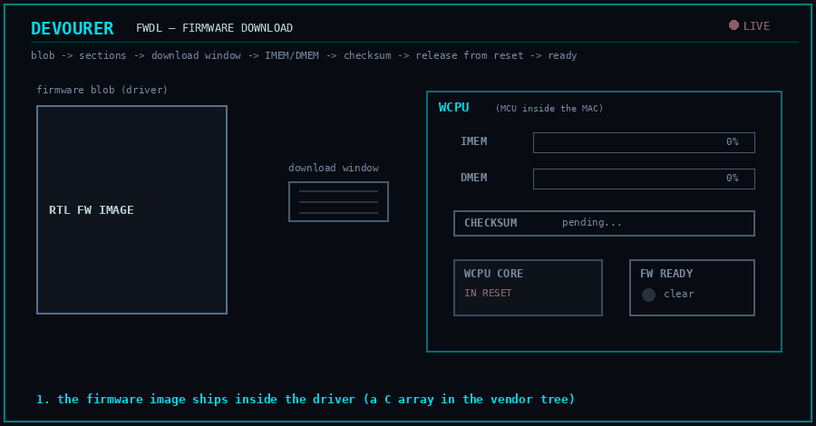

Why does a Wi-Fi chip run its own code? Because some jobs need reactions faster
than a host can deliver over USB: per-frame rate adaptation, power-save timing,
Bluetooth arbitration (§13), calibration sequencing. Those live in **firmware**
executed by the **WCPU**, the microcontroller inside the MAC. The firmware image
ships inside the driver (in the vendor trees it's a giant C array —
`hal/rtl8812a/hal8812a_fw.c`; in devourer, blobs extracted from those arrays by
`tools/extract_*_fw.py`).

**FWDL** — *firmware download* — is the bring-up ritual that installs it. The blob
is parsed into sections, each destined for the WCPU's instruction or data memory
(IMEM/DMEM); the host streams them through a download window; a checksum is
verified; the WCPU is released from reset; and the host polls a **ready bit** until
the firmware announces itself alive. Get any step wrong and you have a very quiet
chip: on some parts a failed firmware boot kills TX while RX still works. The
protocol differs per generation — page-window writes on the oldest parts, a
DMA-based path on the 4-chain 8814, HalMAC-mediated on the middle generation
(`hal/halmac/halmac_88xx/`), a dedicated `mac_ax/fwdl.c` module with per-cut RAM
images on Wi-Fi 6 — but the shape is always blob → sections → checksum → ready.
devourer: `src/jaguar1/FirmwareManager.*`, `src/jaguar2/HalmacJaguar2Fw.h`.

After FWDL the chip is no longer a passive register file — it's a running computer
you share the hardware with. Which raises the next question: how do you talk to it?

## 6. Talking to a running firmware — H2C and C2H

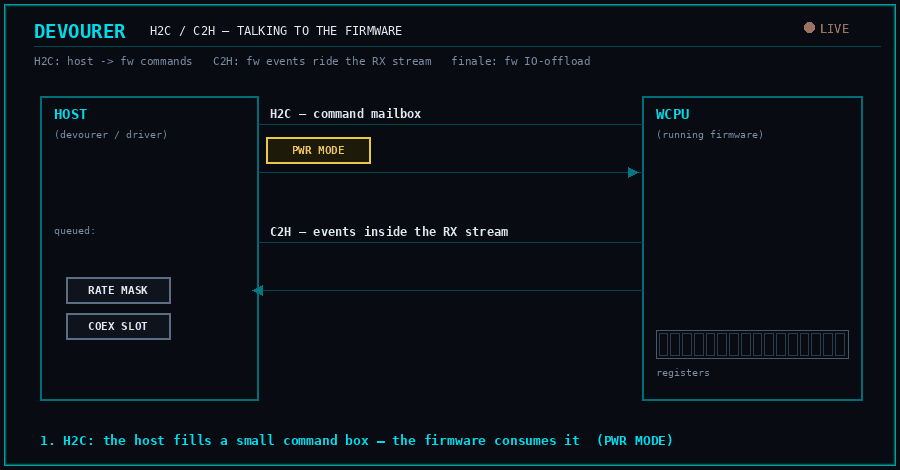

**H2C** — *host to CPU* — is the command mailbox. The host fills a small
fixed-format box (classically 8 bytes: a command id plus parameters) or, on newer
generations, a full descriptor-framed command packet, and the firmware consumes it:
"set power-save mode", "here is the rate mask", "Bluetooth has the antenna next
slot". **C2H** — *CPU to host* — is the return path: the firmware injects event
frames into the RX stream (TX reports, calibration-done, coex telemetry), which the
RX parser must recognize and route past the 802.11 path. Vendor:
`rtl8812a_cmd.c` in the old trees, `mac_ax/fwcmd.c` (a very large file — the whole
command surface) on Wi-Fi 6.

The advanced form is **firmware IO-offload**: instead of the host issuing one
control transfer per register write, it packs an entire *write-list* into H2C
payloads and the firmware replays it locally. On the Wi-Fi 6 parts this is how
the thousands of PHY table writes of §8 are meant to travel — batched via
`mac_ax/h2c_agg.c` and the offload command classes — turning ten thousand USB
round-trips into a handful of bulk transfers. The mental shift matters: past this
point, "writing a register" may really mean "asking the firmware to write it",
with all the asynchrony that implies.

## 7. The MAC — DMAC, CMAC, and a packet's journey

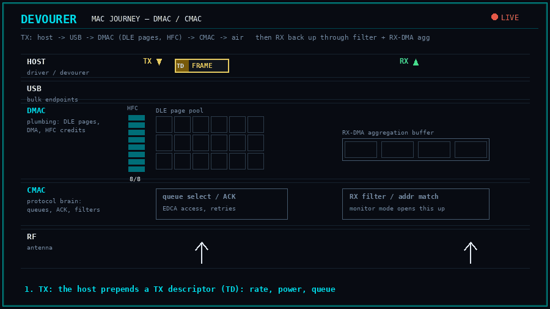

The Wi-Fi 6 generation names the MAC's two halves explicitly, and the names are
worth adopting for every generation because the split is real even where unnamed:

- The **DMAC** (*data MAC*) is the plumbing: DMA engines and buffer management.
  Its allocator, the **DLE** (*data link engine*), carves the chip's shared packet
  RAM into **pages** and deals them out to TX queues and the RX FIFO — the
  bring-up literally programs how many pages each queue owns
  (`mac_ax/dle.c`). TX frames arrive from the host with a **TX descriptor**
  prepended (rate, power, queue, checksums — devourer builds these in each
  generation's frame code); **RX-DMA** runs the other direction, batching received
  frames into aggregated bulk transfers so one URB completion carries many frames.
- The **CMAC** (*control MAC*) is the protocol brain: RX filters (what monitor
  mode opens up), address matching, hardware ACK/BlockAck generation, the TSF
  timer and beaconing machinery of [RF primer §10](rf-primer.md), EDCA channel
  access.

Riding on top is **NIC HFC** — *HCI flow control* (`mac_ax/hci_fc.c`): a credit
scheme in which each TX channel owns a budget of DLE pages, and the host must not
push a frame unless credits cover it. Misconfigure the credit table and the
symptom is maddening: everything green, and one queue silently eating frames.
Vendor: `mac_ax/{init,dle,hci_fc,cmac_tx}.c`; devourer:
`src/jaguar2/HalmacJaguar2MacInit.h`.

The animation follows one frame down (host → bulk URB → descriptor parse → DLE
pages → CMAC → antenna) and one frame up (antenna → CMAC filter → RX-DMA
aggregation buffer → bulk URB → host).

## 8. Programming the PHY — the BB/RF register tables

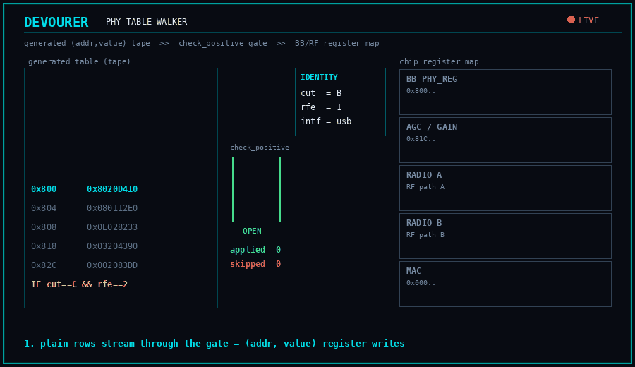

After power-on the BB and RF are *blank* — thousands of registers of filter
coefficients, AGC curves, and RF tunings away from being a radio. The vendor
encodes all of it as **register tables**: long generated arrays of
`(address, value)` pairs replayed at bring-up. Every generation ships the same
quartet:

- **phy_reg** — the BB initialization proper;
- the **AGC table** (also *gain table*) — the receiver's gain-vs-signal-level
  staircase, indexed by band ([RF primer §5](rf-primer.md) is what it controls);
- **radio A** and **radio B** — one table per RF path/die (§9), programming the
  synthesizer and analog stages. Four-chain chips carry radio C/D too;
- a MAC register table for good measure.

Interleaved with plain writes are *conditional* rows — the vendor's
**check_positive** encoding: "the next block applies only if cut == C, or
rfe_type == 2, or this is the USB flavor". The walker evaluates each gate against
the §3 identity and applies or skips the block. This is how one table serves every
board revision. Look at `hal/phydm/rtl8812a/halhwimg8812a_bb.c` — the
`if (check_positive(...))` ladder *is* the format. In the two 11ac generations
these tables and their runtime live in **phydm** (the vendor's "PHY dynamic
management" layer); the Wi-Fi 6 tree splits that world in two — **halbb** owns the
baseband (`phl/hal_g6/phy/bb/`), **halrf** owns the radio and its calibration
(`phl/hal_g6/phy/rf/`) — with the same conditional-table idea inside.

devourer re-implements exactly the walker, not phydm: `src/PhyTableLoader.h`
(shared by the first two generations), plus the per-format variant
`PhyTableLoaderJaguar3.h`. The tables
themselves are *generated* from the vendor trees by `tools/extract_*_phy*.py` —
edit the generators, never the outputs.

## 9. Reaching the radio — LSSI and the RF windows

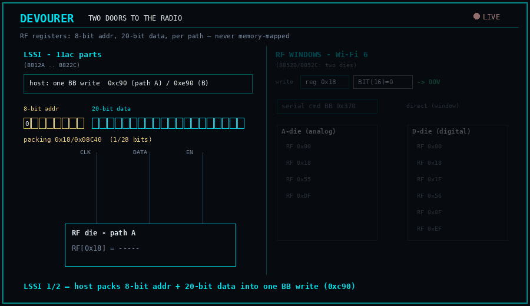

The RF dies keep their own register space — small addresses (an 8-bit space),
20-bit-wide data, one copy per RF path — and none of it is memory-mapped into §2's
address map. Two indirections reach it:

- **LSSI** (*low-speed serial interface*) — the classic path on the 11ac parts: a
  3-wire serial bus from BB to RF. The host writes a BB register (one per path —
  0xc90 for path A, 0xe90 for path B on the Jaguar parts) with address and data
  packed together, and the BB clocks the bits across. Reads come back through a
  BB shadow register. It's slow and write-mostly, which is why RF state is often
  cached and *composed* rather than read back — see
  `RadioManagementModule::phy_set_rf_reg` in `src/jaguar1/`.
- **RF windows** — the Wi-Fi 6 path, where the two-die anatomy of §1 becomes
  software-visible. The **DDV** window (*d-die*, direct view) maps the d-die RF
  registers into BB address space (apertures at 0xe000/0xf000 — path A and B), so
  they're plain window writes; the **DAV** path (*a-die* view) drives the a-die
  RF registers through a serial command register (BB 0x370) — LSSI's descendant.
  The radio tables of §8 encode the die in an address bit, and the walker
  dispatches each row to the right path (the G6 halrf register-access ops).
  Some registers exist on *both* dies and must be written
  through both paths to take effect — channel tuning (§10) is the famous case.

## 10. Tuning a channel — RF18, band, bandwidth, LCK

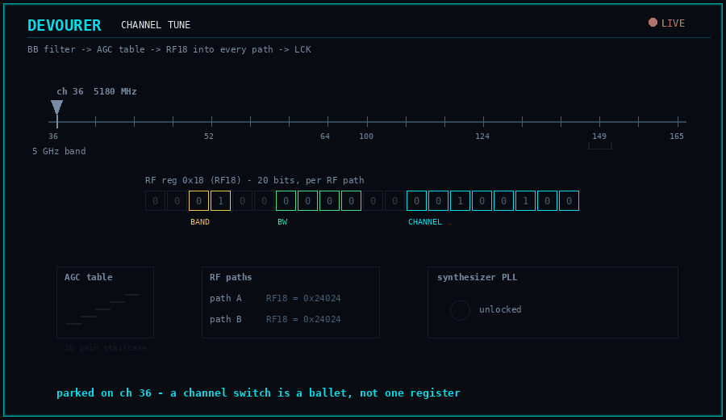

RF register **0x18** — universally "**RF18**" — is the synthesizer's command word:
channel number, band select, and bandwidth bits packed into one 20-bit register
(per path). A channel switch is never *just* RF18, though; the full recipe is a
small ballet across the layers you now know: BB bandwidth/filter settings, the
band's AGC table (§8), band-dependent front-end switches (§3's RFE wiring), then
RF18 into every path — on the two-die parts, through both DAV and DDV (§9) with a
re-latch strobe after. Some synthesizers only re-latch on a *change* of RF18, so
drivers deliberately write a dummy value first — the kind of quirk this layer is
made of. devourer's channel machinery per generation:
`src/jaguar1/RadioManagementModule.cpp`, `src/jaguar2/HalJaguar2` /
`src/jaguar3/RadioManagementJaguar3`; what devourer
builds on top of it (sub-millisecond retunes, per-packet hopping) is
[frequency-hopping.md](frequency-hopping.md).

The synthesizer itself is a PLL whose VCO must *lock* onto the target frequency,
and its tuning constants drift with temperature. **LCK** (*LO/lock calibration*)
re-derives them — run at bring-up and re-run when the thermal meter (§11) has
drifted far enough. A synth that tunes without locking transmits garbage on a
wrong frequency; that's what LCK is protecting you from.

## 11. Calibration — halrf's per-boot rituals

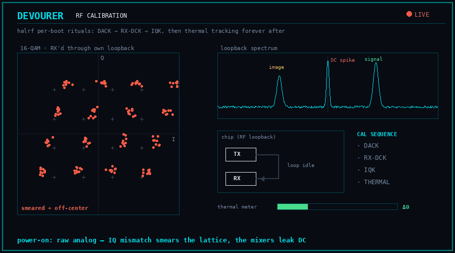

Analog silicon is imperfect per-unit, per-temperature, per-frequency — so after
init tables and before real traffic, the driver calibrates the chip against
itself. The recurring cast, in the order a bring-up runs them:

- **DACK** (*DAC calibration*) — trims the transmit DACs' offset and gain so the
  I and Q converters are true.
- **RX-DCK** (*RX DC calibration*) — nulls the DC offset the receive mixers leak
  into the middle of the spectrum (in OFDM terms: keeps the DC subcarrier's bin
  clean).
- **IQK** (*I/Q calibration*) — the big one. The I and Q arms of the quadrature
  mixers are never perfectly matched in gain and phase; mismatch smears every
  constellation point ([RF primer §2](rf-primer.md)). IQK loops the chip's TX
  into its own RX, measures the image, and programs correction coefficients.
- **TXGAPK** / **DPK** — TX gain-step and digital-predistortion calibrations on
  the newer parts, flattening the PA's behavior across power levels.
- **thermal tracking** — not a one-shot: the RF exposes a thermal meter, and the
  driver periodically compares it to the efuse baseline (§4), adjusting TX gain
  and re-triggering LCK (§10) as the chip heats.

Vendor: `hal/phydm/halrf/` in the 11ac trees; per-algorithm modules
(`halrf_dack_8852b.c`, `halrf_iqk.c`, …) under `phl/hal_g6/phy/rf/` on Wi-Fi 6.
devourer: `src/jaguar1/Iqk8812a.*`, `src/jaguar2/Halrf8822b.*`,
`src/jaguar3/Halrf8822c.*` and friends. The animation shows why you care: the
smeared constellation and DC spike before, the clean lattice after.

## 12. Keeping the receiver alive — BB DM, AGC, and DIG

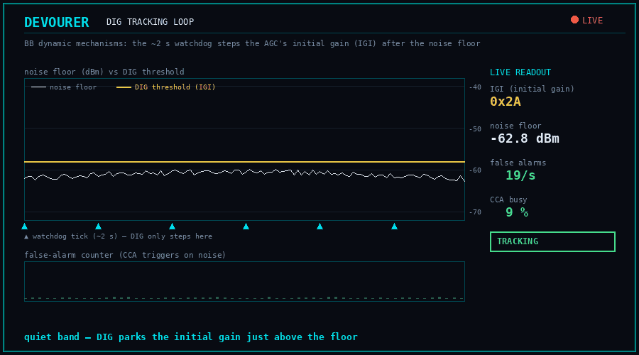

Bring-up ends but the PHY's work doesn't: the radio environment moves, and a set
of slow feedback loops — the **BB dynamic mechanisms** (vendor: the *DM watchdog*,
phydm's original job description, `halbb_dig.c` and friends on Wi-Fi 6) — keep
retuning the receiver every couple of seconds. The star is **DIG** — *dynamic
initial gain*. The AGC of [RF primer §5](rf-primer.md) settles its gain per-frame,
but it has to start each hunt somewhere; that starting point (the *initial gain*,
in vendor code the IGI value) is a sensitivity dial. Set it low and the receiver
false-triggers on noise all day; set it high and it walks past weak frames. DIG
watches the noise floor and false-alarm counters and steps the dial to track the
environment — the animation is that staircase chasing a moving floor.

The supporting cast: **CCK-PD** (the equivalent detection threshold for the
legacy 2.4 GHz CCK preamble), **EDCCA** (the energy-detect clear-channel
threshold — when "the air is busy" is declared), **CFO tracking** (trimming
carrier-frequency offset against the crystal's drift), and the thermal loop of
§11. devourer ports the pieces it needs per generation:
`src/jaguar1/PhydmWatchdog.h`, `src/jaguar3/PhydmRuntimeJaguar3.h`,
`src/CfoTracker.h`.

## 13. Sharing the antenna — coexistence

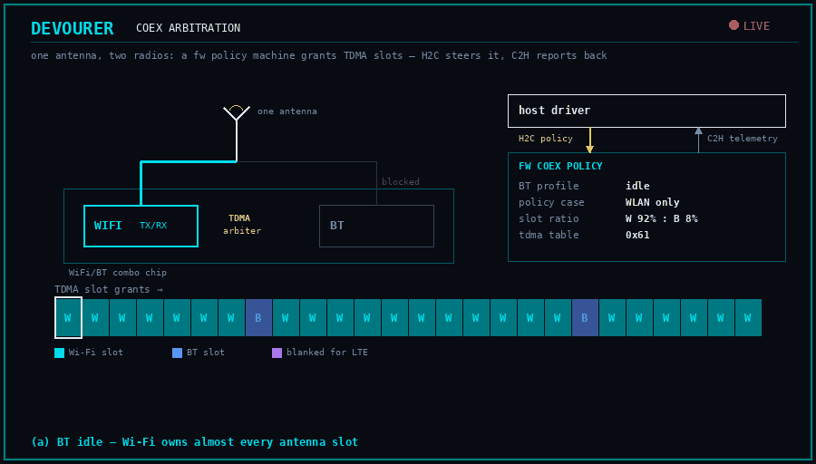

Most of these chips are Wi-Fi/**Bluetooth combos** — two radios, one antenna and
front end. **Coexistence** (*coex*, *BTC*) is the machinery that arbitrates: a
hardware arbiter time-slices the antenna between the two, driven by a policy state
machine that mostly lives in firmware (§5) and is steered over H2C with telemetry
back over C2H (§6). The policy tables are big — who wins during a Wi-Fi TX burst
vs. an ongoing BT voice link is a genuinely hard scheduling problem — and the
driver must keep the firmware's coex state fed even on Wi-Fi-only setups, or the
arbiter can conclude BT owns the air and silence Wi-Fi TX entirely (the Jaguar3
coex runtime exists for exactly this; see [8822e-quirks.md](8822e-quirks.md)).
Vendor: `hal/hal_btcoex.c` in the old trees growing into a full subsystem at
`phl/hal_g6/btc/` on Wi-Fi 6.

The same idea extends off-chip: **WiFi/BT ↔ LTE coexistence**. In a phone or
module, a cellular modem transmitting in an adjacent band will desense the 2.4 GHz
receiver, so the chips run an external handshake bus and another arbitration
table (`mac_ax/coex.c` carries the mailbox). Different radios, same shape: shared
spectrum, negotiated time slices.

## 14. Reading a vendor tree

Now the payoff — the same concepts, found in each generation's source layout.
The architecture visibly evolves: a per-chip monolith, then a monolith with an
abstracted MAC, then a fully layered stack:

```
rtl8812au (11ac gen1)           rtl88x2bu / rtl88x2cu (gen2)    rtl8852bu (Wi-Fi 6, "G6/phl")
─────────────────────           ────────────────────────────    ─────────────────────────────
hal/                            hal/                            phl/
├─ rtl8812a/       chip code    ├─ rtl8822b|c/     chip code    ├─ hci/            USB/PCIe TRX
│  ├─ hal8812a_fw.c   firmware  │  └─ hal8822c_fw.c  firmware   ├─ hal_g6/
│  ├─ rtl8812a_cmd.c  H2C/C2H   ├─ halmac/         MAC layer    │  ├─ mac/
│  ├─ *_hal_init.c    bring-up  │  └─ halmac_88xx/              │  │  ├─ mac_ax/   the MAC
│  └─ usb/            USB ops   │     ├─ *_fw_88xx    FWDL      │  │  │   fwdl.c      FWDL
├─ phydm/          the PHY      │     ├─ *_efuse_88xx efuse     │  │  │   fwcmd.c     H2C/C2H
│  ├─ rtl8812a/    BB/RF/AGC    │     └─ halmac_usb_* USB       │  │  │   h2c_agg.c   IO-offload
│  │   tables (halhwimg*)       ├─ phydm/          the PHY      │  │  │   dle.c       pages
│  └─ halrf/       calibration  │  ├─ rtl8822c/    tables       │  │  │   hci_fc.c    NIC HFC
├─ efuse/          efuse        │  └─ halrf/       calibration  │  │  │   cmac_tx.c   CMAC
├─ hal_btcoex.c    BT coex      ├─ efuse/                       │  │  └─ fw_ax/    firmware blobs
└─ hal_hci/        USB layer    └─ btc/            BT coex      │  ├─ phy/
core/              80211 stack  core/                           │  │  ├─ bb/       halbb (+ tables)
os_dep/            Linux glue   os_dep/                         │  │  └─ rf/       halrf (+ cal)
                                                                │  ├─ efuse/       efuse
                                                                │  └─ btc/         BT coex
                                                                core/, os_dep/     stack + glue
```

Three habits for navigating any of them:

- **Search by concept prefix, not by chip.** `halbb_`, `halrf_`, `halmac_`,
  `halbtc_`, `phydm_` name the layer; the chip name (`8852b`) names the variant
  subdirectory. `hwimg` in a filename means *generated register tables* (§8) —
  huge, skim-only.
- **The `_ops` structs are the table of contents.** Each layer binds its
  chip-specific functions into an ops struct at init; find the struct and you've
  found every entry point that matters.
- **devourer is the same map, shrunk.** `src/jaguar1/` mirrors the rtl8812au
  layout (HalModule / EepromManager / FirmwareManager / RadioManagement),
  `src/jaguar2..3/` mirror the halmac generation (HalmacJaguar*Fw / MacInit,
  Halrf*). When a devourer file puzzles you, its vendor namesake has the
  long-form version — and vice versa.

## Appendix: the glossary

Every term above plus the ones that didn't earn a full section — with where to
find each in the vendor trees and in devourer.

| Term | Meaning | § | Vendor / devourer home |
|---|---|---|---|
| MAC | frame engine: queues, ACKs, filters, timers | 1,7 | `mac_ax/` / per-HAL MacInit |
| BB | baseband — digital PHY (modem, AGC, FFTs) | 1 | `phy/bb/`, `phydm/` / table loaders |
| RF | analog PHY: synthesizer, mixers, gain | 1 | `phy/rf/`, radio tables |
| PA / LNA | power amp (TX) / low-noise amp (RX) front end | 1 | board-level; selected by RFE type |
| WCPU | the MAC's embedded CPU running firmware | 1,5 | booted by FWDL |
| A-die / D-die | analog / digital silicon dies in one package | 1,9 | reached via DAV / DDV |
| URB | USB request block — one queued USB transfer | 2 | `usb_ops_linux.c` / `src/RtlTransport.h` |
| chip id | which die design; drives HAL dispatch | 3 | `SYS_CFG` / `WiFiDriver` factory |
| cut | silicon revision (A/B/C…) | 3 | gates tables + firmware images |
| RFE (type) | board's RF front-end wiring variant, from efuse | 3 | gates PHY table blocks |
| efuse | one-time-programmable per-unit memory | 4 | `hal_efuse.c` / `EepromManager` |
| logical map | decoded fixed-layout view of efuse contents | 4 | `read_efuse_logical_map` |
| firmware | code the WCPU runs (rate adapt, PS, coex, cal) | 5 | `hal*_fw.c`, `fw_ax/` / `tools/extract_*_fw.py` |
| FWDL | firmware download: sections → checksum → ready | 5 | `mac_ax/fwdl.c` / `FirmwareManager`, `HalmacJaguar2Fw` |
| H2C | host→CPU command mailbox | 6 | `*_cmd.c`, `mac_ax/fwcmd.c` |
| C2H | CPU→host events in the RX stream | 6 | RX parsers route them |
| fw IO-offload | register write-lists executed by firmware | 6 | `mac_ax/h2c_agg.c` |
| DMAC | data MAC: DMA, queues, buffer plumbing | 7 | `mac_ax/dle.c` etc. |
| CMAC | control MAC: filters, ACK, TSF, EDCA | 7 | `mac_ax/cmac_tx.c` etc. |
| DLE | page allocator for the shared packet RAM | 7 | `mac_ax/dle.c` |
| RX-DMA | chip→host frame path, aggregated into bulk URBs | 7 | RX parsers per generation |
| NIC HFC | per-queue page-credit TX flow control | 7 | `mac_ax/hci_fc.c` |
| TX descriptor | per-frame header: rate, power, queue | 7 | `src/TxDescBits.h`, frame parsers |
| phy_reg | the BB init register table | 8 | `halhwimg*_bb.c` / generated `hal/` tables |
| AGC / gain table | receiver gain staircase table, per band | 8 | `halhwimg*_agc`… |
| radio A/B tables | RF init tables, one per path | 8 | `halhwimg*_rf.c` |
| check_positive | conditional-row encoding inside the tables | 8 | `src/PhyTableLoader.h` |
| phydm | gen1/2 vendor PHY layer (tables + DM loops) | 8,12 | `hal/phydm/` |
| halbb / halrf | Wi-Fi 6 split: baseband / radio+cal layers | 8 | `phl/hal_g6/phy/{bb,rf}/` |
| LSSI | 3-wire serial bus to the RF die (write 0xc90/0xe90) | 9 | `phy_set_rf_reg` |
| DAV / DDV | a-die (serial 0x370) / d-die (window) RF access | 9 | G6 halrf (`phl/hal_g6/phy/rf/`) |
| RF18 | RF reg 0x18: synthesizer channel/band/BW word | 10 | every `set_channel` |
| LCK | synthesizer lock calibration (thermal re-run) | 10 | halrf; `PhydmRuntimeJaguar3` |
| DACK | TX DAC offset/gain calibration | 11 | `halrf_dack*` |
| RX-DCK | RX DC-offset calibration | 11 | `halrf_*dck*` |
| IQK | I/Q imbalance cal via self-loopback | 11 | `halrf_iqk*` / `Iqk8812a`, `Halrf8822b` |
| TXGAPK / DPK | TX gain-step / predistortion calibrations | 11 | `halrf_*` (newer parts) |
| thermal tracking | meter-vs-efuse-baseline gain compensation | 11 | `src/ThermalStatus.h` |
| BB DM | runtime dynamic mechanisms (the watchdog) | 12 | phydm / halbb / `PhydmWatchdog` |
| AGC | per-frame automatic gain control | 12 | [RF primer §5](rf-primer.md) |
| DIG | dynamic *initial* gain — the AGC's start point | 12 | `halbb_dig.c` / watchdogs |
| CCK-PD / EDCCA | CCK preamble-detect / energy-CCA thresholds | 12 | DM loops; `SetCcaMode` |
| CFO | carrier frequency offset (crystal mismatch) | 12 | `src/CfoTracker.h` |
| BT coex (BTC) | Wi-Fi/Bluetooth antenna arbitration | 13 | `btc/`, `hal_btcoex.c` |
| LTE coex | Wi-Fi/BT ↔ cellular cross-chip arbitration | 13 | `mac_ax/coex.c` mailbox |
| TSF / TBTT | MAC µs clock / beacon schedule timer | 7 | [RF primer §10](rf-primer.md) |

## Where to go next

- [`rf-primer.md`](rf-primer.md) — the physics these blocks implement; the two
  primers are two views of one machine.
- [`8822e-quirks.md`](8822e-quirks.md) — this vocabulary at full density on one
  real chip: pin-mux, coex obligations, calibration ordering.
- [`narrowband.md`](narrowband.md) and
  [`frequency-hopping.md`](frequency-hopping.md) — what devourer builds on top of
  §10's channel machinery.
- [`la-capture.md`](la-capture.md) — using a BB debug block to capture raw IQ:
  §2's register plane pointed at §1's signal path.
- [`performance-tuning.md`](performance-tuning.md) — where the URB plumbing of §2
  and §7 becomes throughput.
- `reference/README.md` — how the vendor trees are vendored and why; CLAUDE.md's
  **Architecture** section — the devourer-side map.
