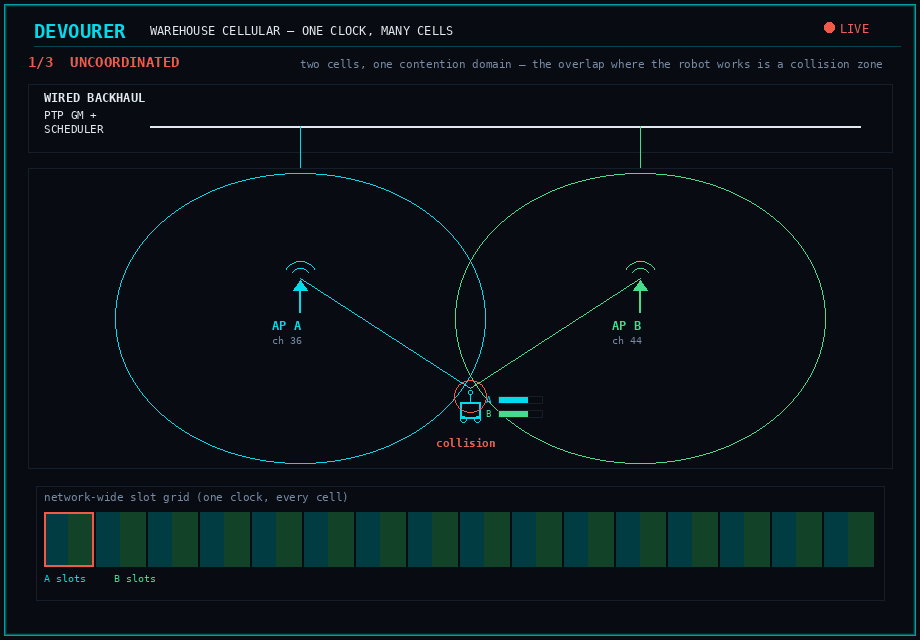

# Building a small cellular network out of Wi-Fi — what the shared clock enables

*Two AP cells on one wired timebase, a robot driving between them. Act 1: no
coordination — the cell-edge is a collision zone. Act 2: the backhaul assigns
orthogonal slots and the edge goes clean. Act 3: the robot crosses cells —
through the transition it holds slots in **both** (duplicating its uplink
across the two channels with a ~ms retune between slots: soft handover), the
scheduler's filtered link-quality estimates cross over (A3-style: margin +
time-to-trigger, not raw RSSI), and its schedule collapses onto B — no scan,
no re-association, no clock re-acquisition; the ghost bar shows the ~100 ms+
hole an ordinary Wi-Fi roam would have punched.*

The [time-distribution machinery](time-distribution.md) ends with a specific
capability: **every radio in a facility — wired or wireless — can share one
microsecond-grade clock**. A wired PTP grandmaster disciplines each AP's Wi-Fi
clock over ordinary Ethernet (~hundreds of ns); each AP's hardware beacon
distributes that clock over the air (~1 µs held); any listening station
inherits it passively (~sub-µs lock). Add the other bench-proven primitives —
millisecond channel switching ([frequency-hopping.md](frequency-hopping.md)),
per-frame hardware receive timestamps, a closed timing-advance loop
([time-distribution.md](time-distribution.md)), TDMA slotting
([narrowband.md](narrowband.md)) — and the ingredient list reads like a small
LTE deployment, minus the licensed spectrum and the basestation price tag.

This page is the conceptual map of what those ingredients build. Everything
below is *architecture riding on proven primitives*: the per-link mechanics all
have bench numbers in the linked docs; the multi-cell coordination itself is
application-layer software — no new silicon tricks required.

## 1. Coordinated scheduling — ICIC over your existing Ethernet

Two APs with overlapping coverage are, in ordinary Wi-Fi, two contenders:
CSMA arbitrates every frame, and at the cell edge — where a client hears both —
throughput and latency degrade exactly where a moving platform can least
afford it. LTE solved this as **Inter-Cell Interference Coordination**:
neighboring cells negotiate who transmits when (or on which resource), so the
edge sees orthogonal, not colliding, transmissions.

The classic obstacle for Wi-Fi is that ICIC presumes the cells agree on *when*:
a slot grid is meaningless if each AP's clock wanders tens of ppm from its
neighbor's. That is precisely what the shared timebase removes. With every
AP's on-air schedule held to the same wired clock at ~1 µs, a slot boundary is
a real, network-wide instant — guard intervals can be tens of microseconds
instead of "re-sync and hope".

The coordination plane is free: the same Ethernet that carries PTP carries the
schedule. Either shape works —

- **centralized**: one scheduler process owns the facility's slot map and
  pushes per-AP assignments (simple, global optimum, single point of failure),
- **peer**: adjacent APs exchange load/interference reports and negotiate
  pairwise (no controller, converges locally — the LTE X2 pattern).

Orthogonality can be in **time** (adjacent cells transmit in disjoint slots —
cheapest, halves the edge airtime), in **frequency** (adjacent cells sit on
different channels and a client retunes in ~ms as it moves — full airtime,
needs the channel-switch primitive), or both (a reuse pattern, exactly like
cellular frequency planning). The right split is a policy decision in the
scheduler, not a driver feature.

## 2. Seamless handover — the big win for anything that moves

An ordinary Wi-Fi roam is a gap: scan for candidates (the client leaves the
serving channel to listen), re-authenticate, re-associate, re-learn the new
AP's timing — ~100 ms on a good day, far more on a bad one. For a stationary
laptop that's a hiccup; for a moving robot streaming control and video it's a
hole in the link, at the worst possible place (the cell edge).

The shared clock dissolves most of that:

- **No time re-acquisition.** The robot's slot schedule is expressed against
  the *network* clock, and every AP's beacons carry that same clock. Timing
  learned in cell A is already valid in cell B — the one thing an ordinary
  roam must painfully rebuild is simply never lost.
- **No discovery scan.** The robot passively hears the neighbor APs' beacons
  (they are on the same timebase; if cells use different channels, a
  millisecond retune during an idle slot samples a neighbor and returns —
  cheap enough to do continuously).
- **Network-side decision.** Each AP hears every robot uplink in range —
  including uplinks addressed to a *neighbor* cell — and tags it with
  per-frame hardware attributes (RSSI, SNR, EVM, per-chain levels). Those
  observations flow over the backhaul, so the network sees the robot's radio
  horizon better than the robot does. One caution borrowed straight from
  cellular practice: **never hand over on raw RSSI** — instantaneous signal
  level swings ±10–20 dB with fast fading, and a threshold comparison
  ping-pongs the client exactly at the cell edge. LTE/5G decide on *filtered*
  measurements with **hysteresis and time-to-trigger** (the A3 event:
  neighbor better than serving *by a margin*, *sustained for a window*), and
  the same discipline applies here — the scheduler filters each AP's
  observations over many uplinks before declaring a crossover, and the richer
  per-frame attributes (SNR/EVM trend, not just level) make that filter
  better-informed than any scan-based client roam.
- **Make-before-break.** The "handover" is then only a schedule update pushed
  over the backhaul: *your slots now belong to AP B (and retune to channel Y)*.
  The robot flips its serving cell between one slot and the next — the
  schedule never stops being valid, so there is nothing to break before the
  make.

What remains of the classic roam cost is security context (whatever key
material the deployment uses must move or pre-stage — the 802.11r-style
problem, solvable over the same backhaul) and the ~ms retune when cells are on
different channels. Both fit inside a single slot guard.

**Soft handover — both cells at once.** The stronger version, and the one
that's genuinely hard to get anywhere else: during the crossing window the
scheduler gives the robot slots in *both* cells, and the robot **duplicates**
its control/video uplink across them — a slot on A's channel, a millisecond
retune, a slot on B's channel, back — while both APs' copies race over the
backhaul and the first one wins (dedup by sequence number). Fading that eats
one path leaves the other; the handover isn't just gap-free, it's
*redundant* exactly where the link is weakest. Downlink works the same way in
reverse (both APs transmit the robot's control frames in their own slots).
This is CDMA-style soft handoff / 5G's PDCP duplication — but where cellular
needs heavyweight, operator-gated dual-connectivity machinery, here it falls
out of two primitives already on the bench: slots that mean the same instant
in every cell (the shared clock) and a channel switch cheap enough to do
per-slot (the ~ms retune). Standard Wi-Fi can't express it at all: one
association, one serving AP, full stop.

## 3. Robots as roaming UEs — the whole picture

Put 1 and 2 together and each robot is, functionally, an LTE UE:

- it **camps** on a serving cell, locked to the network clock through that
  cell's beacons;
- it holds **scheduled resources**: downlink slots for control, uplink slots
  for telemetry and video — sized and placed by the facility scheduler, with
  cell-edge robots given interference-coordinated slots (section 1);
- its uplink timing is closed-loop: the serving AP phase-measures every uplink
  against the slot grid and feeds back a timing advance, so the robot's frames
  land inside their slots even as its propagation delay changes with motion;
- when it crosses a cell boundary, the network moves its schedule to the next
  AP (section 2) and the robot follows — make-before-break, no gap in either
  direction;
- determinism composes: because *everyone* is slotted on one clock, worst-case
  medium access is a schedule property, not a contention statistic — the
  latency budget of a control loop can be written down before deployment.

The honest boundary line, so this page ages well: what is **bench-proven** is
every per-link primitive above, with numbers, in
[time-distribution.md](time-distribution.md) (the clock chain end to end),
[frequency-hopping.md](frequency-hopping.md) (the retune), and
[narrowband.md](narrowband.md) (slotted TDMA on a shared clock). What is
**architecture** is the multi-cell layer: the scheduler, the measurement
aggregation, the handover controller, and the security-context motion — all
ordinary distributed software on the wired side, none of it blocked on the
radio. The primitives were the hard part; they exist and hold their numbers.
