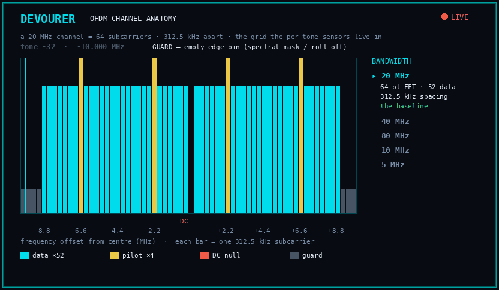
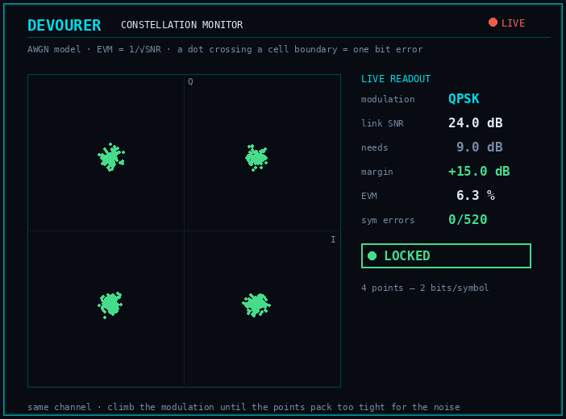
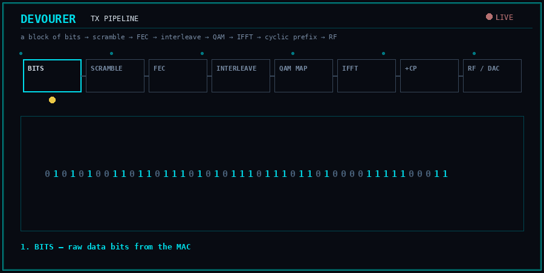
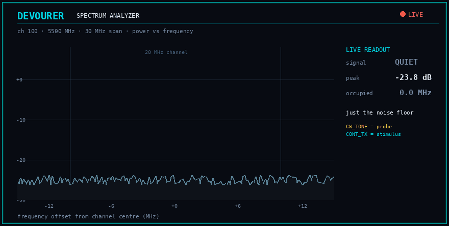
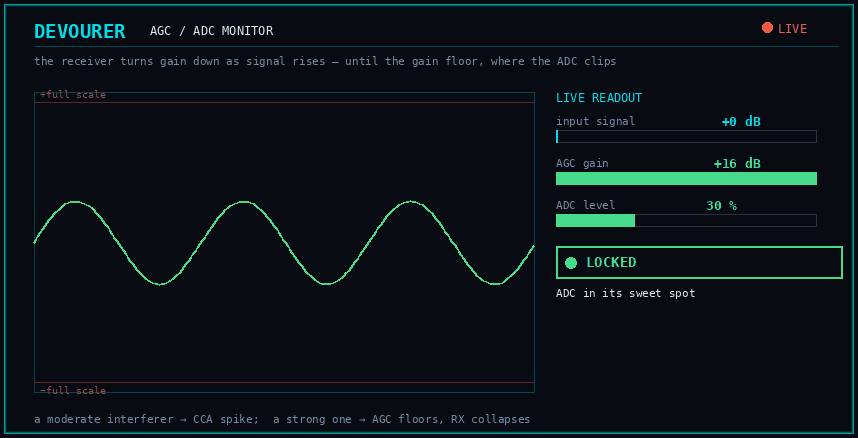
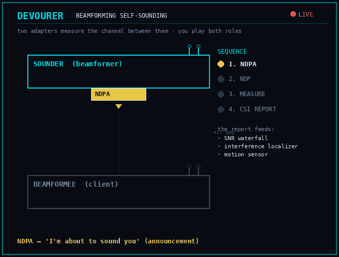
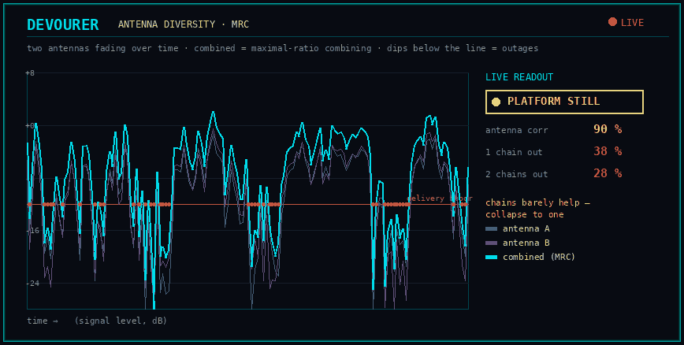
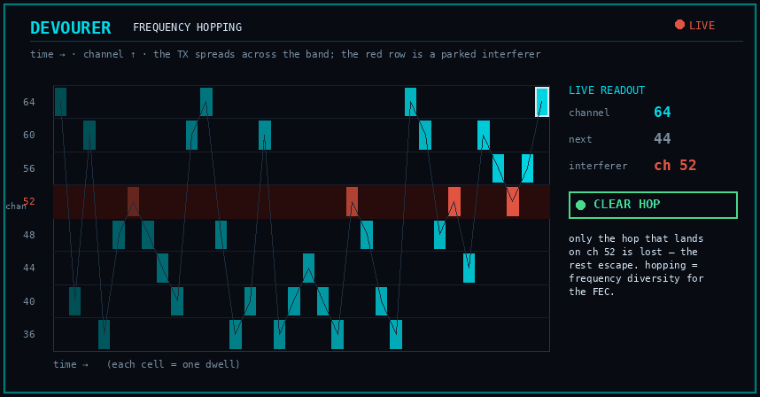
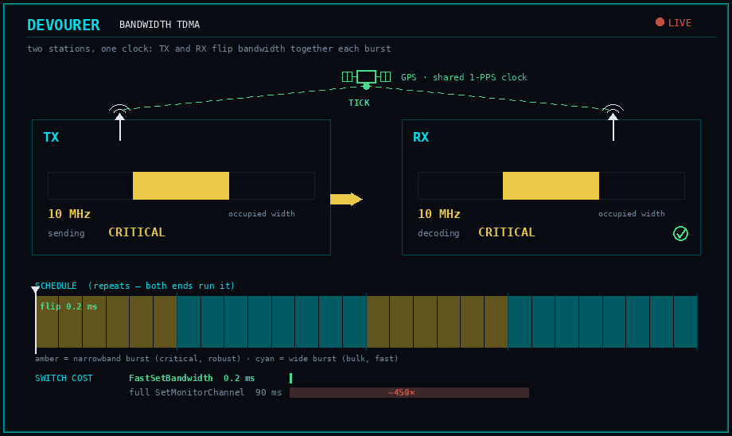
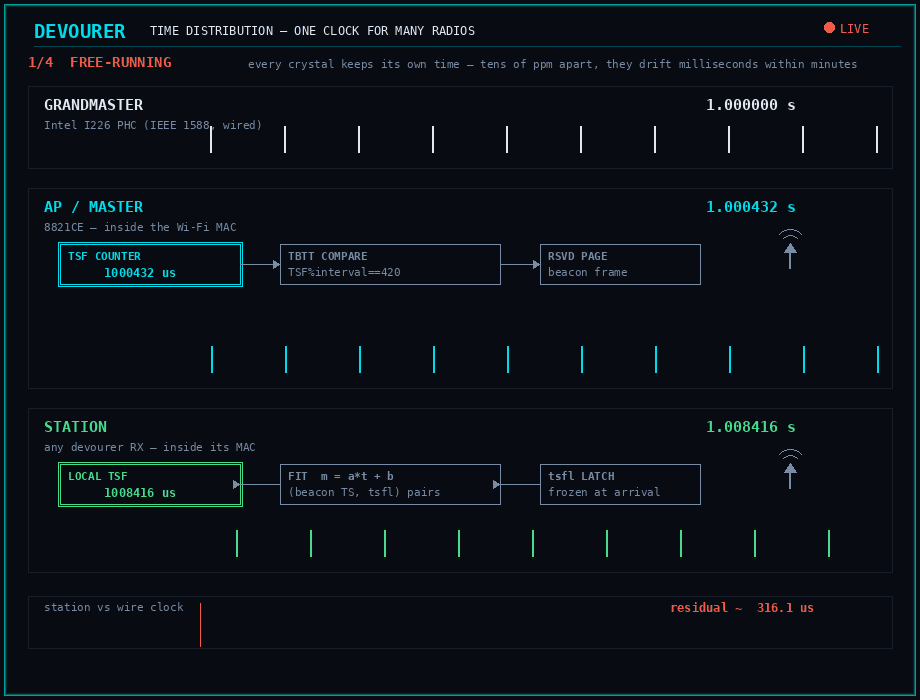

# A visual primer on the RF machinery

devourer talks to a Wi-Fi radio at a very low level — subcarriers, constellations,
gain control, the transmit and receive chains. If you're new to that machinery,
the terms in the other docs (per-tone SNR, EVM, CCA, AGC, occupied bandwidth) can
feel like jargon. This page is a picture book: ten short animations, each
built in the DEVOURER live-monitor style, that show what the machinery actually
looks like — from a single subcarrier all the way to a hopping, diversity-combined,
bandwidth-hopping link. Read it top to bottom and the rest of the docs will click.

Everything here is grounded in what devourer measures — the constellation noise
follows the textbook AWGN model, the spectrum levels are from a real USRP B210
capture, and the AGC behaviour is the very effect the energy sensor keeps seeing.

## 1. The channel — what a "subcarrier" is

A Wi-Fi channel isn't one frequency — it's a comb of many narrow **subcarriers**.
A 20 MHz channel is 64 of them, spaced 312.5 kHz apart: a **DC null** left empty
in the middle, a handful of **pilot** tones the receiver uses to track drift,
dozens of **data** tones that carry the bits, and empty **guard** bins at the
edges so the signal doesn't spill into the neighbours. Wider channels (40/80 MHz)
just add more of the same 312.5 kHz tones; the narrowband 5/10 MHz modes re-clock
to *closer* spacing to fit a thin channel (more robust, less throughput).

This comb is the coordinate system everything per-tone lives in — the
[per-subcarrier SNR waterfall](beamforming-self-sounding.md), the
[NHM power buckets](rx-spectrum-sensing.md), and the tone mask all index into it.

## 2. Modulation — how bits ride the signal, and why SNR matters

Each subcarrier carries bits by taking one of a set of points on the I/Q plane —
the **constellation**. QPSK has 4 points (2 bits each); 256-QAM packs 256 points
(8 bits each). More points = more bits per symbol = more throughput. The catch:
noise nudges each received point away from its ideal spot (that displacement is
the **EVM**), and if it drifts across the boundary into a neighbouring point's
cell, that's a **bit error**. The animation holds one channel and climbs the
modulation: QPSK's points are far apart so there's margin to spare, but 256-QAM
packs them so tight the *same* noise smears the clusters together and the link
breaks. That boundary — the highest modulation a given SNR can hold — is exactly
what the [MCS-headroom probe](adaptive-link-building-blocks.md) measures.

## 3. Building the waveform — the transmit pipeline

So how does a block of bits actually *become* those constellation points on those
subcarriers? A short assembly line: the bits are **scrambled** (whitened so there
are no long runs), **forward-error-coded** (redundancy added so the receiver can
repair errors), **interleaved** (spread out so a fade damages many codewords a
little rather than one a lot), **mapped** onto the subcarrier constellations, run
through an **inverse FFT** that turns all those subcarriers into one time-domain
OFDM symbol, given a **cyclic-prefix** guard (the tail copied to the front, so
echoes off walls don't smear the next symbol), and finally up-converted and
radiated. That last waveform is exactly what the spectrum analyzer below shows.

## 4. On the air — a bare tone vs a modulated carrier

Look at the same signals on a **spectrum analyzer** (power vs frequency). A
**CW tone** puts all its energy at one frequency — a single tall spike, nearly
zero bandwidth; it's a clean narrowband probe or interferer
(`DEVOURER_CW_TONE`). A **modulated carrier** spreads its energy across every
subcarrier — a flat block filling the whole 20 MHz (`DEVOURER_CONT_TX`); it's what
real traffic looks like, and the realistic stimulus for link probing. Same
transmitter, two completely different spectral footprints. (Levels here are a real
B210 capture on ch100: a −25 dB floor, the tone ~+18 dB above it, the block ~+28.)

## 5. At the receiver — gain control, and why a strong signal goes deaf

The receiver can't handle every signal level directly, so an **AGC** (automatic
gain control) turns its gain up for weak signals and down for strong ones, aiming
to keep the ADC in its sweet spot. But the gain has a floor. When a signal is
*too* strong — a transmitter co-located inches away — the AGC runs out of
attenuation, the ADC input exceeds full scale, and the waveform **clips** flat
against the rails. A clipped waveform can't be demodulated: the receiver goes
deaf. That's why, in the [sensing docs](rx-spectrum-sensing.md), a *moderate*
interferer makes the CCA counter **spike** while a *strong* co-located one makes
frames and CCA **collapse** toward zero — the AGC saturating is the collapse.

## 6. Measuring the channel — beamforming self-sounding

To know *how good* each subcarrier is, you have to measure the channel between two
radios. The sequence: the **sounder** announces (NDPA), sends a **known waveform**
on every subcarrier (NDP), the **beamformee** compares what arrived to what it
knows was sent — that's the per-subcarrier channel `H(k)` — and sends back a
compressed **CSI report**. With two adapters you own, you play both roles yourself
(*self-sounding*). That report is the source of the per-subcarrier SNR waterfall,
the per-tone interference localizer, and the motion sensor.

## 7. Combining two antennas — diversity under motion

Multipath makes a signal **fade** — deep dips that come and go. Two antennas help,
but only when they see *different* fades. Held **still**, closely-spaced antennas
see almost the same channel: they dip together, so combining them (maximal-ratio
combining) barely fills the holes and the second chain is mostly wasted power.
Under **motion** the antennas decorrelate — when one is in a fade the other
usually isn't — so the combined signal fills the deep fades and outages drop
sharply. That's why the number of active receive chains is a *fade-state* lever,
not a range lever, and why a motion signal tells the controller when to open them.

## 8. Spreading across the band — frequency hopping

Instead of parking on one channel, the link can **hop** channel to channel every
dwell, spreading its energy across the band. A narrowband interferer sitting on
one channel then only clips the occasional hop that lands on it — every other hop
escapes. Done per-packet (`DEVOURER_HOP_*`), hopping doubles as a
frequency-diversity interleaver for the outer FEC: losses are spread thin across
frequencies instead of wiping out a run of packets on one.

## 9. Trading robustness for throughput in time — bandwidth TDMA

Narrowband (section 1) is more robust but slower; a wide channel is faster but
needs a healthier link. You don't have to pick one for the whole session — you
can **alternate them in time**. The link runs a schedule of bursts: a narrowband
burst carries the frames you cannot lose (a keyframe, a control message) at a
robust rate, then a wide burst carries the bulk at a fast rate, then back — so
the occupied width **breathes** burst to burst. What makes this practical is that
switching bandwidth is nearly free (~0.2 ms — a single baseband re-clock register
via [`FastSetBandwidth`](narrowband.md)), so the schedule can flip many times a
second. The catch, and the reason it's *bursts* and not per-frame: narrowband and
20 MHz are different sample-clock domains, so a receiver decodes exactly one width
at a time — both ends have to flip **together**. Either the receiver switches in
lockstep with the transmitter (synced by a shared clock or by the transmitter's
own marker frames), or a second receiver camps permanently on the narrowband band
as an independent, always-listening robust link for the critical frames. The
runnable version is the [`tdma`](narrowband.md) example; the switch machinery it
rides on is in [`narrowband.md`](narrowband.md).

## 10. One clock for many radios — distributing time

*Three clocks becoming one, with the Wi-Fi MAC opened up: the AP lane shows the
silicon path — TSF counter → TBTT comparator → reserved-page beacon getting its
timestamp written at the antenna — and the station lane shows the arrival latch
feeding the fit. Watch the tick combs converge and the residual strip go
red → green.*

Every radio keeps time with its own crystal, and no two crystals agree: a
typical pair differs by tens of **ppm** (parts per million) — a few
microseconds of drift every second, milliseconds within minutes. That's
invisible to ordinary networking, but fatal to anything that needs devices to
*act at the same instant*: TDMA slots (section 9's "shared clock"!),
synchronized captures, multi-node measurements. Time synchronization is the
machinery that makes many free-running clocks behave as one.

The reason it's hard is not the math — it's **timestamping**. To compare two
clocks you exchange a message and note when it left and when it arrived; any
jitter in *taking those notes* becomes error you can never remove. Software
stamps are taken by a CPU juggling interrupts and schedulers, so they wobble by
hundreds of microseconds. The whole game is getting the **hardware** to take
the notes at the instant the bits actually cross the wire or leave the antenna.

The chain in the animation is how devourer plays that game, link by link:

- **The wire (PTP, IEEE 1588).** Ethernet solved this years ago: PTP-capable
  NICs (like the Intel I226) timestamp sync messages *in the PHY*, as the bits
  hit the cable, and expose their clock as a **PHC** (`/dev/ptpN`). Two such
  NICs discipline each other to tens of nanoseconds. This is the reference —
  the "GPS" of the setup, except it arrives over the LAN.
- **The AP's Wi-Fi clock (the TSF).** Every 802.11 MAC carries a free-running
  microsecond counter, the **TSF**. devourer exposes it (`ReadTsf`; on the
  PCIe 8821CE even as a Linux PHC), so `phc2sys` can servo it against the wired
  reference — it holds to the wire at ~290 ns RMS, which is the TSF's own
  1 µs-resolution floor. The Wi-Fi chip's clock is now wire-true.
- **The air (hardware beacons).** How do stations get that time with no wire?
  The same way they've always found APs: **beacons**. Every beacon carries a
  64-bit timestamp, and — the crucial hardware trick — the MAC writes the
  *live TSF into the frame at the moment it leaves the antenna*, and every
  receiving MAC latches its own TSF at the moment of arrival (`tsfl`). Both
  notes are taken in silicon; no CPU touches the timing path. A station just
  listens, fits `master_time = a·my_time + b` over the beacons it hears, and
  tracks the AP to ~0.3 µs (the grey scatter in the animation is where
  software-stamped beacons would land instead).
- **The pin (holding the schedule).** One subtlety closes the loop: the beacon
  *schedule* (the TBTT) is a separate hardware timer, and servoing the TSF
  doesn't move it. Steering it naively means jumping the TSF — corrupting the
  very clock the servo reads. `PinBeaconTbtt` does the re-arm and then puts
  the TSF back on its timeline (~10 µs of disturbance over PCIe), so the beacon
  schedule snaps onto the disciplined clock while the clock trace runs
  unbroken. The on-air beacon grid holds to the wired reference at ~1 µs.

End to end: a station with nothing but a devourer receiver inherits a wired
PTP timebase, over the air, to a few microseconds — wire (ns) → AP TSF
(~290 ns) → beacon (~0.3 µs) → held schedule (~1 µs). The full write-up,
per-chip mechanics, and bench tables are in
[`time-distribution.md`](time-distribution.md); the closed discipline loop is a
runnable tool (`tests/pcie_ptp_beacon.cpp`).

---

## Where to go next

With the machinery in hand, the rest reads straight:

- [`rx-spectrum-sensing.md`](rx-spectrum-sensing.md) — reading energy, noise, and
  interference off that channel comb, frame-free (includes the animated NHM
  monitor).
- [`beamforming-self-sounding.md`](beamforming-self-sounding.md) — measuring the
  per-subcarrier channel with two adapters (the animated SNR waterfall).
- [`adaptive-link-building-blocks.md`](adaptive-link-building-blocks.md) — the
  levers, sensors, and probes that turn all of the above into an adaptive link,
  and [`adaptive-link.md`](adaptive-link.md) — the objective they serve.
- [`narrowband.md`](narrowband.md) — the 5/10 MHz re-clock machinery, the cheap
  bandwidth switch, and the burst-TDMA example from section 9.
- [`time-distribution.md`](time-distribution.md) — the full time-sync machinery
  from section 10: per-generation TBTT steering, the PTP bridge, and every
  bench number behind the animation.
