# A visual primer on the RF machinery

devourer talks to a Wi-Fi radio at a very low level — subcarriers, constellations,
gain control, the transmit and receive chains. If you're new to that machinery,
the terms in the other docs (per-tone SNR, EVM, CCA, AGC, occupied bandwidth) can
feel like jargon. This page is a picture book: fifteen short animations, each
built in the DEVOURER live-monitor style, that show what the machinery actually
looks like — from a single subcarrier all the way to a hopping,
diversity-combined, multi-user link. Read it top to bottom and the rest of the
docs will click.

Everything here is grounded in what devourer measures — the constellation noise
follows the textbook AWGN model, the spectrum levels are from a real USRP B210
capture, and the AGC behaviour is the very effect the energy sensor keeps seeing.

## 1. The channel — what a "subcarrier" is

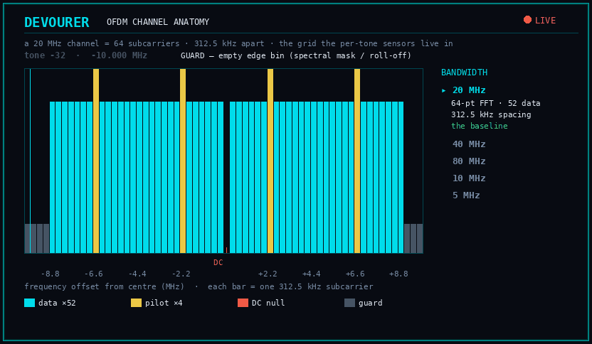

A Wi-Fi channel isn't one frequency — it's a comb of many narrow **subcarriers**.
A 20 MHz channel is 64 of them, spaced 312.5 kHz apart: a **DC null** left empty
in the middle, a handful of **pilot** tones the receiver uses to track drift,
dozens of **data** tones that carry the bits, and empty **guard** bins at the
edges so the signal doesn't spill into the neighbours. Wider channels (40/80 MHz)
just add more of the same 312.5 kHz tones; the narrowband 5/10 MHz modes re-clock
to *closer* spacing to fit a thin channel (more robust, less throughput).

This comb is the coordinate system everything per-tone lives in — the
[per-subcarrier SNR waterfall](beamforming-self-sounding.md), the
[NHM power buckets](rx-spectrum-sensing.md), and the tone mask all index into it.

## 2. Modulation — how bits ride the signal, and why SNR matters

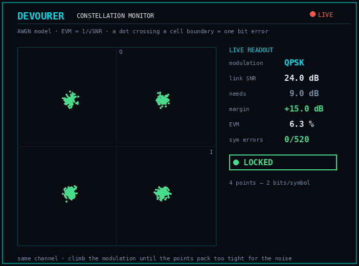

Each subcarrier carries bits by taking one of a set of points on the I/Q plane —
the **constellation**. QPSK has 4 points (2 bits each); 256-QAM packs 256 points
(8 bits each). More points = more bits per symbol = more throughput. The catch:
noise nudges each received point away from its ideal spot (that displacement is
the **EVM**), and if it drifts across the boundary into a neighbouring point's
cell, that's a **bit error**. The animation holds one channel and climbs the
modulation: QPSK's points are far apart so there's margin to spare, but 256-QAM
packs them so tight the *same* noise smears the clusters together and the link
breaks. That boundary — the highest modulation a given SNR can hold — is exactly
what the [MCS-headroom probe](adaptive-link-building-blocks.md) measures.

## 3. Building the waveform — the transmit pipeline

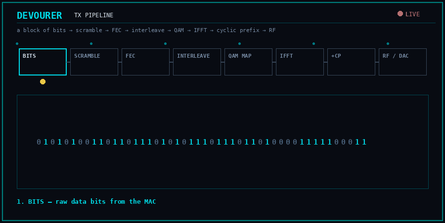

So how does a block of bits actually *become* those constellation points on those
subcarriers? A short assembly line: the bits are **scrambled** (whitened so there
are no long runs), **forward-error-coded** (redundancy added so the receiver can
repair errors), **interleaved** (spread out so a fade damages many codewords a
little rather than one a lot), **mapped** onto the subcarrier constellations, run
through an **inverse FFT** that turns all those subcarriers into one time-domain
OFDM symbol, given a **cyclic-prefix** guard (the tail copied to the front, so
echoes off walls don't smear the next symbol), and finally up-converted and
radiated. That last waveform is exactly what the spectrum analyzer below shows.

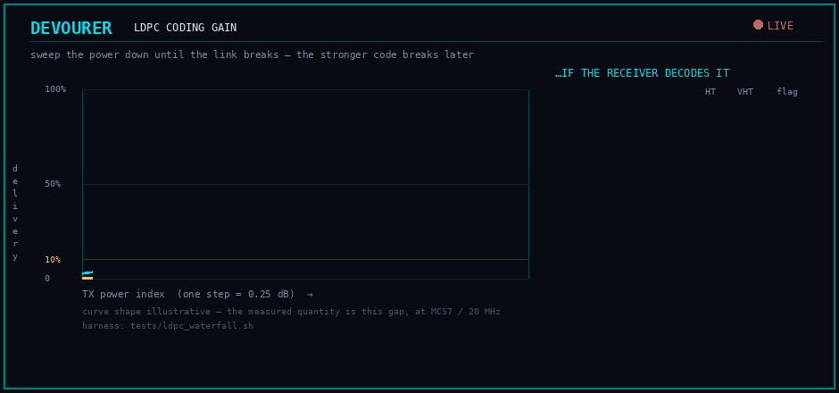

The second stage of that line — the **code** — is worth a picture of its own,
because it is the one you get to choose per frame. 802.11 offers two: the older
convolutional code (BCC) and **LDPC**. Sweep the transmit power down until the
link falls over and plot delivery against power, and both curves drop off a
cliff — that shape is why it's called a **waterfall**. The stronger code's cliff
simply sits further left: at the 10 %-delivery crossing, about 3 dB further at
MCS7/20 MHz on the bench. Three decibels of nothing but arithmetic — no extra
power, no antenna, no lower rate.

The catch is the other end. Coding only pays if the receiver decodes it, and on
this hardware that is not uniform: the RTL8821A misses VHT-LDPC (HT is fine),
and the RTL8814A decodes both but exposes no per-frame indicator, so you can't
*see* it in the receive telemetry even though it worked. That table is
bench-derived and deliberately not the vendor driver's advertised policy, which
claims none of the 11ac parts can decode LDPC at all — a claim the 8812A
disproves on air. Ask the device (`GetAdapterCaps`) rather than the datasheet.

## 4. On the air — a bare tone vs a modulated carrier

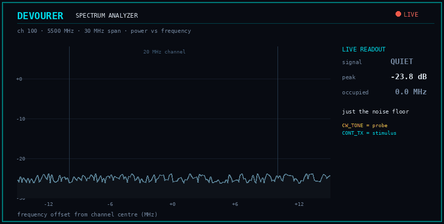

Look at the same signals on a **spectrum analyzer** (power vs frequency). A
**CW tone** puts all its energy at one frequency — a single tall spike, nearly
zero bandwidth; it's a clean narrowband probe or interferer
(`DEVOURER_CW_TONE`). A **modulated carrier** spreads its energy across every
subcarrier — a flat block filling the whole 20 MHz (`DEVOURER_CONT_TX`); it's what
real traffic looks like, and the realistic stimulus for link probing. Same
transmitter, two completely different spectral footprints. (Levels here are a real
B210 capture on ch100: a −25 dB floor, the tone ~+18 dB above it, the block ~+28.)

## 5. At the receiver — gain control, and why a strong signal goes deaf

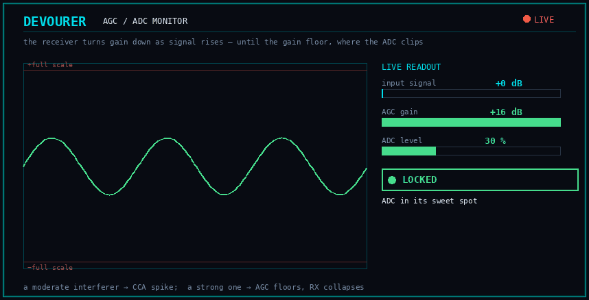

The receiver can't handle every signal level directly, so an **AGC** (automatic
gain control) turns its gain up for weak signals and down for strong ones, aiming
to keep the ADC in its sweet spot. But the gain has a floor. When a signal is
*too* strong — a transmitter co-located inches away — the AGC runs out of
attenuation, the ADC input exceeds full scale, and the waveform **clips** flat
against the rails. A clipped waveform can't be demodulated: the receiver goes
deaf. That's why, in the [sensing docs](rx-spectrum-sensing.md), a *moderate*
interferer makes the CCA counter **spike** while a *strong* co-located one makes
frames and CCA **collapse** toward zero — the AGC saturating is the collapse.

## 6. Measuring the channel — beamforming self-sounding

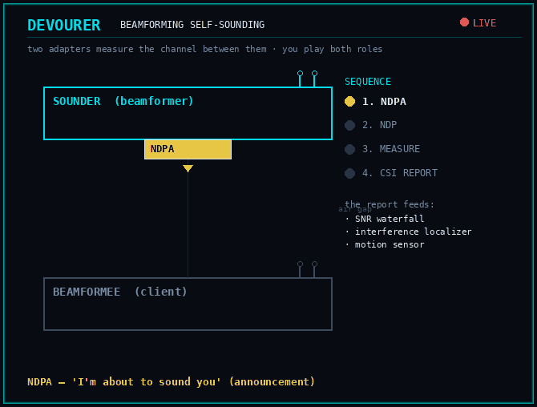

To know *how good* each subcarrier is, you have to measure the channel between two
radios. The sequence: the **sounder** announces (NDPA), sends a **known waveform**
on every subcarrier (NDP), the **beamformee** compares what arrived to what it
knows was sent — that's the per-subcarrier channel `H(k)` — and sends back a
compressed **CSI report**. With two adapters you own, you play both roles yourself
(*self-sounding*). That report is the source of the per-subcarrier SNR waterfall,
the per-tone interference localizer, and the motion sensor.

## 7. Combining two antennas — diversity under motion

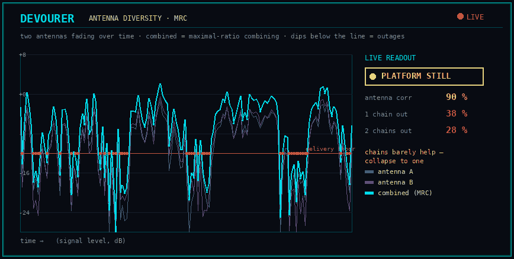

Multipath makes a signal **fade** — deep dips that come and go. Two antennas help,
but only when they see *different* fades. Held **still**, closely-spaced antennas
see almost the same channel: they dip together, so combining them (maximal-ratio
combining) barely fills the holes and the second chain is mostly wasted power.
Under **motion** the antennas decorrelate — when one is in a fade the other
usually isn't — so the combined signal fills the deep fades and outages drop
sharply. That's why the number of active receive chains is a *fade-state* lever,
not a range lever, and why a motion signal tells the controller when to open them.

## 8. Spreading across the band — frequency hopping

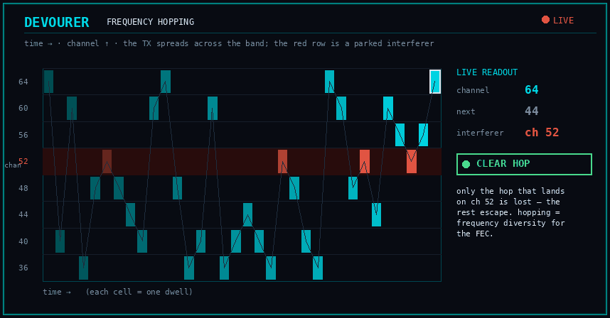

Instead of parking on one channel, the link can **hop** channel to channel every
dwell, spreading its energy across the band. A narrowband interferer sitting on
one channel then only clips the occasional hop that lands on it — every other hop
escapes. Done per-packet (`DEVOURER_HOP_*`), hopping doubles as a
frequency-diversity interleaver for the outer FEC: losses are spread thin across
frequencies instead of wiping out a run of packets on one.

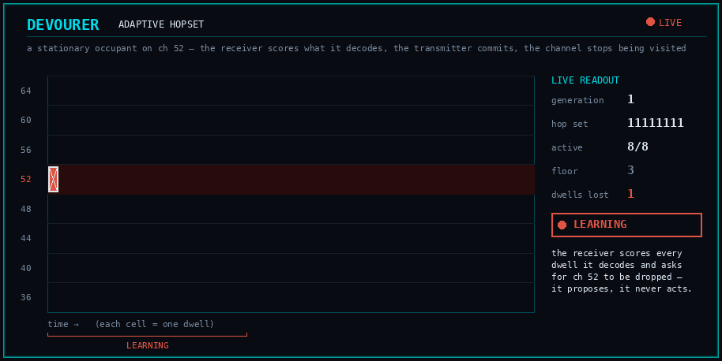

Bounding the damage is not the same as avoiding it. Most interference is
*furniture* — a fixed AP, a neighbouring video link, a microwave, a radar. It
isn't trying to win; it's just sitting there, and it will still be sitting there
in an hour. A hop set that keeps visiting its channel keeps paying for it, every
round, forever. The **receiver** is the endpoint that has to decode, so its
per-channel delivery is the authoritative evidence (energy
readings only *classify* an impairment; a quiet channel with a dead link and a
noisy one that still delivers are opposite decisions). It **proposes**; it never
acts. The transmitter owns the schedule, and answers with an authenticated commit
naming a **future** slot, repeated until that slot arrives — so both ends swap
schedules together and a lost frame can't split them apart. Because the hop order
is **keyed**, dropping a channel re-keys the permutation rather than leaving a
readable gap in a pattern. And exclusion is not a ratchet: keyed **probes** go
back and look — the round, the position and the channel all derived from the key,
so recovery isn't itself a periodic target — and a channel that recovered comes
back. Measured against a narrowband interferer parked on one member of a
four-channel set: delivery 0.72 → 0.83, with the channel restored on its own once
the interferer stopped.

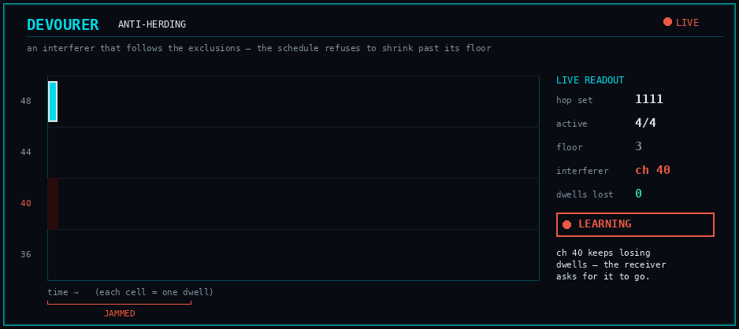

Now take the furniture away and put something *adversarial* there instead, and
the picture above stops being the story — the one that replaces it ends with the
link still bleeding, and that ending is the point. Two measurements say why.
Against a **blind** parked jammer, a keyed hop order and a plainly sequential one
deliver identically — secrecy buys nothing against something that isn't looking;
it only earns its keep against an adversary that *reacts*. And against a jammer that
**follows** — moving onto a still-active channel after every exclusion — the link
does not get better. It gets *walked down*. And notice that every one of those
exclusion requests is individually correct: the receiver really is losing that
channel, and dropping it really would help, for about a dozen dwells. Granted
without limit, that reasonable-looking sequence ends with the link parked on one
frequency of the attacker's choosing, which is exactly where an adversary wants
it. So an adaptive exclusion loop is itself an attack surface, and the shipped
one is built timid on purpose: one channel per update, a mandatory gap between
updates (a *refused* proposal spends it too, so bouncing proposals can't flood
the control path), nothing acted on when the whole band degrades together, and a
hard **floor** on how many channels stay active. When that floor is reached the
next proposal is refused, however well-evidenced it is, and the link spends the
rest of the flight bleeding across the channels it has left rather than being
herded onto one. On the four-channel bench set the floor binds after a single
exclusion, and that's the measured result: exclusion depth one, active set held
at three, no collapse. It is a pass rather than a win, and the difference matters
— the advantage here isn't that the link learns, it's that it learns without
becoming teachable by an adversary. The protocol, the policy and the numbers are
in [`fhss.md`](fhss.md).

## 9. Trading robustness for throughput in time — bandwidth TDMA

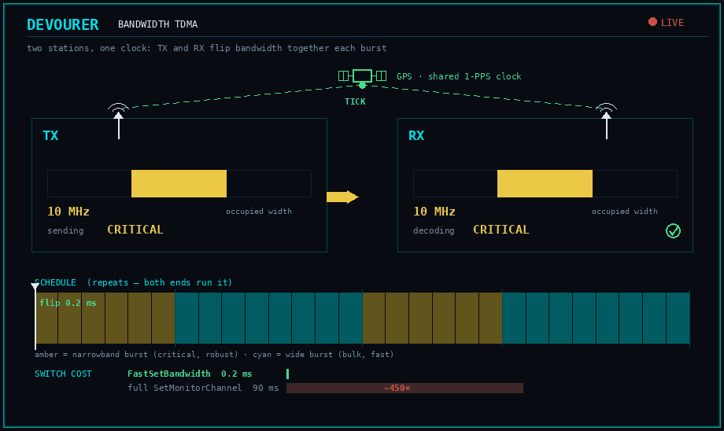

Narrowband (section 1) is more robust but slower; a wide channel is faster but
needs a healthier link. You don't have to pick one for the whole session — you
can **alternate them in time**. The link runs a schedule of bursts: a narrowband
burst carries the frames you cannot lose (a keyframe, a control message) at a
robust rate, then a wide burst carries the bulk at a fast rate, then back — so
the occupied width **breathes** burst to burst. What makes this practical is that
switching bandwidth is nearly free (~0.2 ms — a single baseband re-clock register
via [`FastSetBandwidth`](narrowband.md)), so the schedule can flip many times a
second. The catch, and the reason it's *bursts* and not per-frame: narrowband and
20 MHz are different sample-clock domains, so a receiver decodes exactly one width
at a time — both ends have to flip **together**. Either the receiver switches in
lockstep with the transmitter (synced by a shared clock or by the transmitter's
own marker frames), or a second receiver camps permanently on the narrowband band
as an independent, always-listening robust link for the critical frames. The
runnable version is the [`tdma`](narrowband.md) example; the switch machinery it
rides on is in [`narrowband.md`](narrowband.md).

## 10. One clock for many radios — distributing time

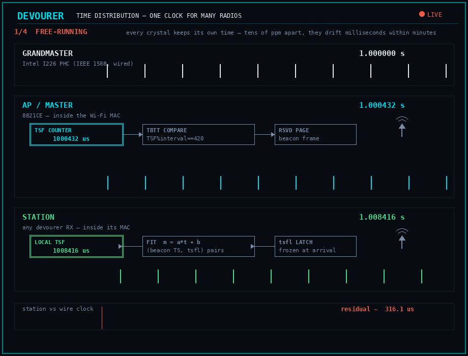

*Three clocks becoming one, with the Wi-Fi MAC opened up: the AP lane shows the
silicon path — TSF counter → TBTT comparator → reserved-page beacon getting its
timestamp written at the antenna — and the station lane shows the arrival latch
feeding the fit. Watch the tick combs converge and the residual strip go
red → green.*

Every radio keeps time with its own crystal, and no two crystals agree: a
typical pair differs by tens of **ppm** (parts per million) — a few
microseconds of drift every second, milliseconds within minutes. That's
invisible to ordinary networking, but fatal to anything that needs devices to
*act at the same instant*: TDMA slots (section 9's "shared clock"!),
synchronized captures, multi-node measurements. Time synchronization is the
machinery that makes many free-running clocks behave as one.

The reason it's hard is not the math — it's **timestamping**. To compare two
clocks you exchange a message and note when it left and when it arrived; any
jitter in *taking those notes* becomes error you can never remove. Software
stamps are taken by a CPU juggling interrupts and schedulers, so they wobble by
hundreds of microseconds. The whole game is getting the **hardware** to take
the notes at the instant the bits actually cross the wire or leave the antenna.

The chain in the animation is how devourer plays that game, link by link:

- **The wire (PTP, IEEE 1588).** Ethernet solved this years ago: PTP-capable
  NICs (like the Intel I226) timestamp sync messages *in the PHY*, as the bits
  hit the cable, and expose their clock as a **PHC** (`/dev/ptpN`). Two such
  NICs discipline each other to tens of nanoseconds. This is the reference —
  the "GPS" of the setup, except it arrives over the LAN.
- **The AP's Wi-Fi clock (the TSF).** Every 802.11 MAC carries a free-running
  microsecond counter, the **TSF**. devourer exposes it (`ReadTsf`; on the
  PCIe 8821CE even as a Linux PHC), so `phc2sys` can servo it against the wired
  reference — it holds to the wire at ~290 ns RMS, which is the TSF's own
  1 µs-resolution floor. The Wi-Fi chip's clock is now wire-true.
- **The air (hardware beacons).** How do stations get that time with no wire?
  The same way they've always found APs: **beacons**. Every beacon carries a
  64-bit timestamp, and — the crucial hardware trick — the MAC writes the
  *live TSF into the frame at the moment it leaves the antenna*, and every
  receiving MAC latches its own TSF at the moment of arrival (`tsfl`). Both
  notes are taken in silicon; no CPU touches the timing path. A station just
  listens, fits `master_time = a·my_time + b` over the beacons it hears, and
  tracks the AP to ~0.3 µs (the grey scatter in the animation is where
  software-stamped beacons would land instead).
- **The pin (holding the schedule).** One subtlety closes the loop: the beacon
  *schedule* (the TBTT) is a separate hardware timer, and servoing the TSF
  doesn't move it. Steering it naively means jumping the TSF — corrupting the
  very clock the servo reads. `PinBeaconTbtt` does the re-arm and then puts
  the TSF back on its timeline (~10 µs of disturbance over PCIe), so the beacon
  schedule snaps onto the disciplined clock while the clock trace runs
  unbroken. The on-air beacon grid holds to the wired reference at ~1 µs.

End to end: a station with nothing but a devourer receiver inherits a wired
PTP timebase, over the air, to a few microseconds — wire (ns) → AP TSF
(~290 ns) → beacon (~0.3 µs) → held schedule (~1 µs). The full write-up,
per-chip mechanics, and bench tables are in
[`time-distribution.md`](time-distribution.md); the closed discipline loop is a
runnable tool (`tests/pcie_ptp_beacon.cpp`).

## 11. Many stations in one channel — OFDMA and the Trigger frame

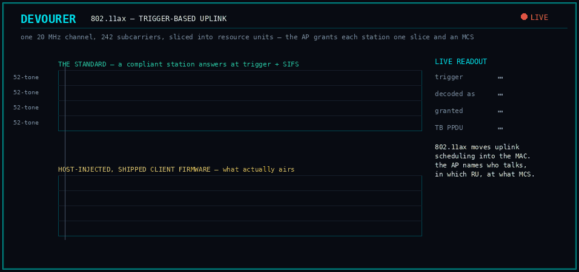

Everything so far has assumed one transmitter at a time: stations contend, one
wins, it gets the whole channel for the length of its frame. 802.11ax breaks
that assumption in the frequency direction. The comb from section 1 is carved
into **resource units** — 26, 52, 106 or 242 tones — and several stations can
transmit *simultaneously*, each inside its own slice of the same 20 MHz.

Sharing like that only works if somebody assigns the slices, so 11ax moves
uplink scheduling into the MAC. The AP sends a **Trigger** frame whose per-user
fields each name a station, the resource unit it may use, an MCS, and a target
receive power. A compliant station that finds its identifier in a Trigger
answers exactly one **SIFS** later — about 16 µs — inside the granted slice.
Nobody contends, nobody backs off, and the uplink jitter that plagues ordinary
Wi-Fi disappears. This is the standard's road to cellular-style scheduled
access, and it's why a Wi-Fi 6 radio is interesting for a coordinated link and
not just a faster one.

The animation is what that machinery looks like from this side of it. You write
a grant table — who, which resource unit, what MCS, how many spatial streams,
what receive power to aim for — devourer builds the Trigger frame around it and
transmits it on the Kestrel generation, and an independent monitor pulls every
one of those parameters back off the air unchanged. Command in, frame out,
parameters verified: that round trip is what makes the adapter useful as an
**instrument** for 11ax work. You can put an arbitrary, exactly-specified
Trigger on the air and watch what other equipment does with it — which is
otherwise gear you rent.

One boundary comes with it. The *reply* is hardware-timed: the receiving MAC
has to arm a receive window at trigger + SIFS, and it only does that for a
Trigger its own firmware scheduled. Frames injected from the host ride the
ordinary transmit path, so a station gets a perfectly valid Trigger and no
timing cue to answer it — and the shipped client firmware accepts the
scheduling commands (trigger scheduler, TWT, sounding) without executing them.
Generating the schedule is available; owning it needs firmware these parts
don't carry. [`he-trigger-ul.md`](he-trigger-ul.md) has the API and the full
account of which paths close.

## 12. Reaching further — extended range and dual-carrier modulation

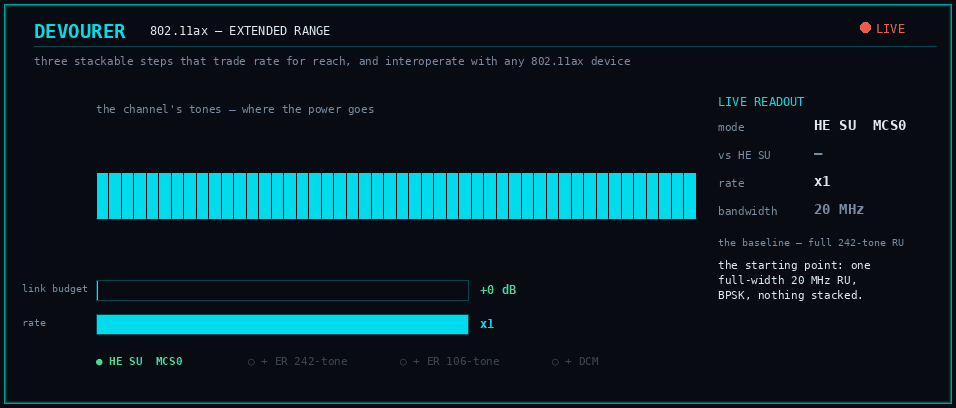

The same generation has a corner built for the opposite goal. **HE ER SU** is a
20 MHz-only format that stacks three tricks, each worth roughly 3 dB and each
paid for in rate.

The first is acquisition. Before a receiver can decode anything it has to
*find* the frame, and at long range the preamble fails before the payload does;
ER SU repeats the signalling field so the preamble survives a weaker signal.
The second is concentration: the 106-tone variant puts the same transmit power
into half as many tones, so every tone that is still lit gets twice as much.
The third is **DCM** — dual-carrier modulation — which sends every symbol twice
on two tones far enough apart that a narrow fade can't take both copies. Notice
which kind of gain each one is: the first two help you acquire, the last one
helps you decode, and only the last one costs payload rate.

Fully stacked at the lowest rate, the ladder buys roughly 8–10 dB over a plain
HE frame. Compare that with the **narrowband** modes of section 9: re-clocking
to 5 or 10 MHz is a bigger and more predictable win, about 3 dB per halving of
the noise bandwidth, but it is *private* — both ends have to be running
devourer. ER SU is smaller and weighted toward acquisition, and it
interoperates with any 802.11ax device. Devourer at both ends? Use narrowband.
Standard gear at the far end? This is the lever you have.
[`he-extended-range.md`](he-extended-range.md) has the on-air matrix.

---

## Where to go next

With the machinery in hand, the rest reads straight:

- [`driver-primer.md`](driver-primer.md) — this primer's sibling: the same
  picture-book treatment for the *silicon and driver* machinery (registers,
  efuse, firmware, MAC, PHY tables, calibration) that implements all of the
  above.
- [`rx-spectrum-sensing.md`](rx-spectrum-sensing.md) — reading energy, noise, and
  interference off that channel comb, frame-free (includes the animated NHM
  monitor).
- [`beamforming-self-sounding.md`](beamforming-self-sounding.md) — measuring the
  per-subcarrier channel with two adapters (the animated SNR waterfall).
- [`adaptive-link-building-blocks.md`](adaptive-link-building-blocks.md) — the
  levers, sensors, and probes that turn all of the above into an adaptive link,
  and [`adaptive-link.md`](adaptive-link.md) — the objective they serve.
- [`he-trigger-ul.md`](he-trigger-ul.md) and
  [`he-extended-range.md`](he-extended-range.md) — the 802.11ax half from
  sections 11 and 12: Trigger frames and the scheduling surface, the ER SU /
  DCM range ladder and its measured on-air matrix.
- [`narrowband.md`](narrowband.md) — the 5/10 MHz re-clock machinery, the cheap
  bandwidth switch, and the burst-TDMA example from section 9.
- [`time-distribution.md`](time-distribution.md) — the full time-sync machinery
  from section 10: per-generation TBTT steering, the PTP bridge, and every
  bench number behind the animation.
- [`multi-ap-cellular.md`](multi-ap-cellular.md) — what section 10's shared
  clock builds at facility scale: coordinated cells, make-before-break
  handover, roaming robot UEs (with its own animation).
