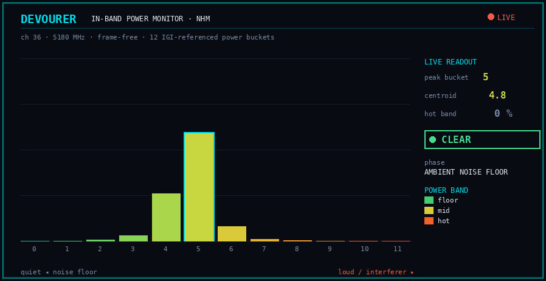

# RX spectrum sensing / interferer detection

The inverse of `DEVOURER_CW_TONE`: use the adapter as a coarse **energy sensor**
to detect an in-channel interferer — no SDR, two adapters (one emits a tone, one
senses).

## What the silicon can and can't give you

No Realtek 88xx chip (Jaguar1/2/3 — 8812AU/8814AU/8821AU/8822BU/8821CU/8822CU/
8822EU) exports raw **per-subcarrier CSI** to the host. The beamforming CSI is
computed in the BB and transmitted over the air as a compressed report; there is
no DMA readback of the channel matrix. So a true per-tone FFT of the receive
spectrum is not available on this hardware.

What *is* available is **scalar, channel-wide** energy:

- **phydm false-alarm (FA) + CCA (clear-channel-assessment / channel-busy)
  counters**, and the **DIG initial-gain (IGI)** noise-floor proxy. These are
  read frame-free (no received frame required) and increment with in-band energy
  and channel activity.
- **NHM (noise histogram)** — a frame-free in-band **power distribution**: the BB
  bins received power into 12 IGI-referenced buckets over a short measurement
  window. Richer than the scalar counters — it shows *where* in power the energy
  sits, so a rising interferer moves the histogram's mass into higher buckets
  without needing a sweep. Ported from phydm CCX across all three generations
  (11AC register map for Jaguar1/2, the newer JGR3 map for Jaguar3).
- **per-frame per-chain RSSI / SNR / EVM** — link-quality scalars averaged over
  the whole channel, available only on frames that arrive.

To turn scalar energy into a coarse *spectrum*, sweep the channel/bandwidth and
sample the energy per bin (narrowband down to 5 MHz on Jaguar3 and the
Jaguar2 8821C). Per-tone
interference localisation is possible through a different mechanism entirely —
the self-sounding beamforming report (see `docs/beamforming-self-sounding.md`),
whose per-tone SNR / V-angle variance localises an interferer to ~1 MHz.

## Noise floor — passive vs active (absolute dBm)

Two noise floors are exposed on `GetRxQuality()`:

- **Passive** (`noise_floor_dbm`, always on) — the per-frame `rssi_dbm − snr_db`,
  averaged over the window. It updates only when a wanted frame arrives, but that
  is exactly the self-jamming signal (raising TX power on a near-field link drops
  SNR while RSSI holds, so this rises). Works on every generation.
- **Active / frame-free absolute** (`abs_noise_floor_dbm`, opt-in
  `DEVOURER_RX_NOISE_FLOOR`) — the vendor idle-noise monitor, a true idle-channel
  floor measured with **no wanted signal** (site survey, channel selection). It
  adds ~10 ms of USB round-trips, so it is off by default. The vendor active
  measurement can **wedge a live RX**, so devourer only ever runs it RX-idle:
  - **Jaguar1 (8812A/8821A)** — the debug-port sampling path (fix IGI, stop
    CK320/CK88, read the RX I/Q at `0x0FA0`, `pwdb = 10·log10(I²+Q²)`, average
    5 idle samples) stops clocks and resets BB/PMAC/CCK, which wedges concurrent
    bulk-IN DMA. devourer runs it **once at bring-up, before `StartRxLoop`** —
    RX-idle by construction, wedge-free — and caches the value; on-air 0/6 wedged
    runs vs the live-poll's 2/6. Re-measure by re-`Init`. The 8814A is excluded
    (different vendor path).
  - **Jaguar2 (8822B/8821C)** — the HW idle-noise report at `0x0FF0` (freeze
    `0x9E4[30]`, `noise = −110 + IGI + report`) has no clock-stop, so it is read
    live. It is only intermittently populated in monitor bring-up (it reads the
    `0x80`/`0x00` sentinels between idle gaps), so it returns a value on some
    reads and null on others — poll until valid. When valid it cross-matches the
    Jaguar1 floor within a few dB on the same channel.
  - **Jaguar3 (8822C/8822E)** — no vendor idle-noise path (the report dispatch
    excludes the 8822C), so `abs_noise_floor_dbm` is always null; the passive
    floor is J3's only floor.

  Validation: `tests/rx_noise_floor_active_onair.sh` (anti-wedge + sanity /
  cross-chip agreement — a B210 injected-noise sweep isn't used because the bench
  SDR is too weakly coupled to move the RTL floor above the measurement variance).

## `DEVOURER_RX_ENERGY_MS` — the energy sensor

`rxdemo` with `DEVOURER_RX_ENERGY_MS=N` emits one `rx.energy`
event every `N` ms:

```json
{"ev":"rx.energy","t":..,"cca_ofdm":..,"cca_cck":..,"fa_ofdm":..,"fa_cck":..,
 "igi":..,"frames":N,"rssi_mean":..,"rssi_max":..,"snr_mean":..,"snr_min":..}
```

`cca_*`/`fa_*`/`igi` are frame-free (`IRtlDevice::GetRxEnergy`, `null` on a chip
that doesn't expose them); the FA/CCA counts
are the delta since the previous event (each read resets the hardware counters).
`rssi_*`/`snr_*`/`frames` are the rolling per-frame aggregate over the interval.

The same call also fills the **NHM power histogram**, emitted as a companion
`rx.nhm` event (kept distinct so the `rx.energy` fields its consumers key on
are untouched):

```json
{"ev":"rx.nhm","peak":..,"busy":..,"dur":..,"hist":[b0,b1,..,b11]}
```

`peak` is the fullest bucket (0 = noise floor, higher = energy in a higher power
band), `busy` the percent of samples above the lowest bucket, `hist` the 12 raw
IGI-referenced counts (low→high power). A frame-free measurement: the driver sets
11 thresholds, pulses a trigger, polls a ready bit, and reads 12 counters.



*The NHM histogram, animated (`tools/nhm_histogram_gif.py`; the shapes are the
real distributions devourer measured). Twelve IGI-referenced power buckets, quiet
on the left, loud on the right. On a clean channel the mass sits low (peaking
around bucket 5); as a narrowband interferer rises it marches into the hot
buckets — the whole detection signal, frame-free, no received frame required. On
the 2T2R 8822CU a co-located CW tone drives the peak from bucket 5 to bucket 8;
a strong carrier saturates it into bucket 11.*

The facilities differ by generation but all three read the same fields:

| Generation | FA/CCA/IGI + NHM | register map |
|---|---|---|
| Jaguar1 (8812/8821/8814) | yes | classic AC — FA 0xF48/0xA5C, CCA 0xF08, IGI 0xC50; NHM 0x994/0x990/0x998/0xfa8/0xfb4 |
| Jaguar2 (8822BU/8821CU) | yes | classic AC (FA/CCA sampled by the DIG thread; same NHM map) |
| Jaguar3 (8822CU/8822EU) | yes | newer BB — CCA 0x2c08, CCK-FA 0x1a5c, OFDM-FA 0x2d0x, IGI 0x1d70; NHM 0x1e60/0x1e40/0x1e44/0x2d40/0x2d4c |

## Detecting a tone

Run `DEVOURER_CW_TONE` on adapter A and `DEVOURER_RX_ENERGY_MS` on adapter B, same
channel. The sensor's `cca_ofdm` leaves its ambient band in one of two directions,
both an unambiguous detection:

- **spike** — the CCA registers the carrier as busy and the count jumps far above
  baseline (measured ~13–380× on the 2T2R 8822CU);
- **collapse** — a strong co-located carrier saturates the AGC, the RX goes deaf,
  and the count (and received frames) fall toward zero (the 1T1R 8821AU / 8821CU).

The `rx.nhm` histogram is the corroborating signal: the tone moves the
distribution's mass into higher power buckets (measured: peak bucket 5→8 on the
8822CU under a co-located CW tone), so `peak` rises and the high-index `hist`
buckets fill where the baseline had zeros.

Which direction depends on the chip's AGC behaviour and the tone strength relative
to saturation. `tests/rx_energy_probe.sh` runs the two-adapter test (baseline vs
tone) and `tests/rx_energy_check.py` asserts the two are clearly separable.

A weaker or spread interferer (e.g. `DEVOURER_NB_BW=5` OFDM instead of a bare CW)
stays in the moderate regime where `cca_ofdm` rises without saturating.

## `DEVOURER_RX_SWEEP` — a coarse spectrum map

The energy sensor reads one channel at a time; to localise an interferer in
frequency, sweep. With `DEVOURER_RX_SWEEP="1,6,11"` the sensor cycles the listed
bins — the RX loop runs on a worker thread while the main thread retunes between
reads via `IRtlDevice::FastRetune` (the lean intra-band hop path every
generation implements; `DEVOURER_RX_SWEEP_FULL=1` forces the full
`SetMonitorChannel` per dwell for A/B) — and emits one `rx.energy`
event (tagged `"ch":N`) per bin. Aggregating those into an energy-vs-frequency bar chart peaks (or,
on the saturating 1T1R parts, dips) at the tone's channel.

The bin spec uses the SweepSpec grammar (`src/SweepSpec.h`, shared with
`DEVOURER_HOP_CHANNELS`): channel lists (`1,6,11`), channel ranges (`36-48/4`),
or centre-frequency MHz ranges (`5170-5250/5`).

Each `ch=N` line carries the frame-free counters plus `retune_us=` (the measured
dwell-switch cost) and the per-dwell frame aggregate —
`frames/rssi_mean/rssi_max/snr_mean/snr_min/evm_mean` over the frames decoded
during that dwell. `DEVOURER_RX_AGG_SA=canon|<mac>` restricts the aggregate to
one transmitter's SA (the active-sounding filter; default counts every frame).
The aggregate is drained at each dwell start, so retune-transient frames never
leak into a bin.

The resolution is the channel grid: 20 MHz on the 2.4/5 GHz plan, and down to
~5 MHz on Jaguar3 and the Jaguar2 8821C (`DEVOURER_NB_BW=5` — the 2.4 GHz channels are 5 MHz apart, so
stepping them at 5 MHz bandwidth gives 5 MHz bins; fast dwells preserve the
narrowband dividers, so an NB sweep never re-runs the re-clock recipe). This is
a scalar-energy spectrum, not an FFT — there is no sub-channel structure within
a bin.

Passive-map caveat (measured, both retune paths): a bare CW tone sitting exactly
on an NB bin's centre lands at DC after downconversion and the receiver's DC
null hides it from CCA — the tone registers on the *adjacent* 5 MHz bins
instead. A modulated interferer doesn't have this blind spot.

`tests/rx_spectrum_sweep.sh` runs a single live sweep and `tests/rx_spectrum_sweep.py`
renders the map + flags the peak/dip bin.

## Active two-ended sounding — a coarse H(f) of the link

The passive map sees interferers but is blind to fading of *our own* path (a
faded-but-quiet bin looks clean). Active sounding probes it: the TX end hops
fixed-rate probe beacons (the canonical SA) across the bin list via FastRetune
while the RX end sweeps the same bins with `DEVOURER_RX_AGG_SA=canon`, so each
`ch=N` line reports the probe's per-bin RSSI/EVM — a genuine coarse sounding of
H(f) over the actual link.

Synchronisation is asymmetric-duty with no control channel: the TX cycles all
bins fast and the RX dwells ≥ ~2 full TX cycles per bin, so every dwell overlaps
at least one probe visit. `tests/sounding_sweep.sh` orchestrates the pair
(computing the duty maths from the bin count), and `tests/sounding_map.py`
renders the recovered map — headline metric is the per-bin median of `rssi_max`
(off-channel bleed decodes weaker, never stronger, so the dwell max is
bleed-robust), with NOTCH (≥ 6 dB below the across-bin median) and DEAD (no
probe frames while other bins hit) flags, and an optional Spearman
rank-correlation against a B210 wideband capture
(`tests/hop_rx_probe.py --bin-power-csv`).

Measured (8822CU → 8812EU, 5 GHz, `--bins 5170-5250/5 --nb-bw 5`): all 17
five-MHz bins sounded, recovering a smooth ~15 dB notch centred at 5230 MHz with
monotone roll-in/out across neighbouring bins — frequency-selective structure a
20 MHz scalar cannot resolve. NB sounding needs both ends narrowband (the probe
must decode); a retune can wedge one in-flight probe frame into a bulk-OUT
timeout (seen on the 8812EU at NB on both retune paths), which the orchestrator
rides out with `DEVOURER_TX_MAXFAIL=0` — scattered single-frame loss is noise to
the map.

## Per-tone localisation

Finer than the channel grid needs a different mechanism: the self-sounding
beamforming report (`docs/beamforming-self-sounding.md`), the only per-tone
readout this silicon offers, since the compressed report is computed in the BB
rather than DMA'd as a raw channel matrix. It carries two per-subcarrier
observables a narrowband interferer perturbs on just the tones it covers:

- **per-tone SNR** (the MU Exclusive report) — an interferer raising the noise
  floor on a subcarrier group cuts its SNR: a localized notch;
- **per-tone cross-frame ψ variance** — an interferer corrupting the channel
  estimate on those tones makes the compressed steering angle jump frame to
  frame: a localized variance spike.

`tests/rx_tone_localize.py` decodes the reports (reusing `tools/bf_report_decode.py`),
robustly thresholds both observables (median/MAD outliers, or a differential
against a clean baseline), groups the flagged tones, and maps each group to a
frequency — resolution `BW/Ns`, ~385 kHz per subcarrier group on 20 MHz Ng=1,
i.e. sub-channel. `tests/rx_tone_localize.sh` drives the MU self-sounding rig and
an optional CW-tone interferer. The detection + frequency-mapping math is guarded
headlessly by the `rx_tone_localize_math` CTest (`--self-test`).

Regime caveat (measured): on a flat, short line-of-sight bench with the
interferer co-located inches away, the per-tone structure is quantisation-limited
(the ψ variance floor competes with a real notch) and a CW interferer is bistable
— weak enough to avoid saturating the receiver leaves it buried in that floor,
strong enough to register collapses the whole report path (the AGC-saturation
regime of the energy sensor above). The localiser bites where the interferer is
spatially separated or the channel is frequency-selective (multipath / wider BW),
so the per-tone SNR develops real structure above the quantisation floor.
