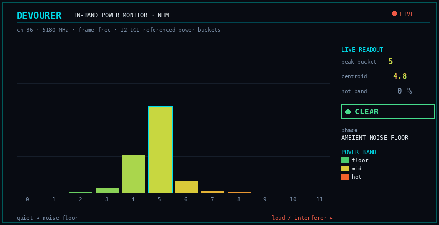

# RX spectrum sensing / interferer detection

The inverse of `DEVOURER_CW_TONE`: use the adapter as a coarse **energy sensor**
to detect an in-channel interferer — no SDR, two adapters (one emits a tone, one
senses).

## What the silicon can and can't give you

No Realtek 88xx chip (Jaguar1/2/3 — 8812AU/8814AU/8821AU/8822BU/8821CU/8822CU/
8822EU) exports raw **per-subcarrier CSI** to the host. The beamforming CSI is
computed in the BB and transmitted over the air as a compressed report; there is
no DMA readback of the channel matrix. So a true per-tone FFT of the receive
spectrum is not available on this hardware.

What *is* available is **scalar, channel-wide** energy:

- **phydm false-alarm (FA) + CCA (clear-channel-assessment / channel-busy)
  counters**, and the **DIG initial-gain (IGI)** noise-floor proxy. These are
  read frame-free (no received frame required) and increment with in-band energy
  and channel activity.
- **NHM (noise histogram)** — a frame-free in-band **power distribution**: the BB
  bins received power into 12 IGI-referenced buckets over a short measurement
  window. Richer than the scalar counters — it shows *where* in power the energy
  sits, so a rising interferer moves the histogram's mass into higher buckets
  without needing a sweep. Ported from phydm CCX across all three generations
  (11AC register map for Jaguar1/2, the newer JGR3 map for Jaguar3).
- **CLM (channel load measurement)** — the fraction of a window in which the
  baseband held the channel busy, counted by hardware in 4 µs ticks. The one
  number here that is *airtime* rather than an event count, so it compares
  directly across channels and adapters without per-adapter normalisation.
- **per-frame per-chain RSSI / SNR / EVM** — link-quality scalars averaged over
  the whole channel, available only on frames that arrive.

To turn scalar energy into a coarse *spectrum*, sweep the channel/bandwidth and
sample the energy per bin (narrowband down to 5 MHz on Jaguar3 and the
Jaguar2 8821C). Per-tone
interference localisation is possible through a different mechanism entirely —
the self-sounding beamforming report (see `docs/beamforming-self-sounding.md`),
whose per-tone SNR / V-angle variance localises an interferer to ~1 MHz.

## Noise floor — passive vs active (absolute dBm)

Two noise floors are exposed on `GetRxQuality()`:

- **Passive** (`noise_floor_dbm`, always on) — the per-frame `rssi_dbm − snr_db`,
  averaged over the window. It updates only when a wanted frame arrives, but that
  is exactly the self-jamming signal (raising TX power on a near-field link drops
  SNR while RSSI holds, so this rises). Works on every generation.
- **Active / frame-free absolute** (`abs_noise_floor_dbm`, opt-in
  `DEVOURER_RX_NOISE_FLOOR`) — the vendor idle-noise monitor, a true idle-channel
  floor measured with **no wanted signal** (site survey, channel selection). It
  adds ~10 ms of USB round-trips, so it is off by default. The vendor active
  measurement can **wedge a live RX**, so devourer only ever runs it RX-idle:
  - **Jaguar1 (8812A/8821A)** — the debug-port sampling path (fix IGI, stop
    CK320/CK88, read the RX I/Q at `0x0FA0`, `pwdb = 10·log10(I²+Q²)`, average
    5 idle samples) stops clocks and resets BB/PMAC/CCK, which wedges concurrent
    bulk-IN DMA. devourer runs it **once at bring-up, before `StartRxLoop`** —
    RX-idle by construction, wedge-free — and caches the value; on-air 0/6 wedged
    runs vs the live-poll's 2/6. Re-measure by re-`Init`. The 8814A is excluded
    (different vendor path).
  - **Jaguar2 (8822B/8821C)** — the HW idle-noise report at `0x0FF0` (freeze
    `0x9E4[30]`, `noise = −110 + IGI + report`) has no clock-stop, so it is read
    live. It is only intermittently populated in monitor bring-up (it reads the
    `0x80`/`0x00` sentinels between idle gaps), so it returns a value on some
    reads and null on others — poll until valid. When valid it cross-matches the
    Jaguar1 floor within a few dB on the same channel.
  - **Jaguar3 (8822C/8822E)** — no vendor idle-noise path (the report dispatch
    excludes the 8822C), so `abs_noise_floor_dbm` is always null; the passive
    floor is J3's only floor.
  - **Kestrel (8852B/8852C, Wi-Fi 6)** — the cleanest source: Realtek's halbb
    **NHM env-monitor** (`halbb_env_mntr_trigger`/`result` → `nhm_pwr − 110`), a
    proper frame-free BB measurement with no clock-stop → no wedge. On-air the
    **8852B reads a correct idle floor (−93 dBm, cross-matches the passive floor
    within ~1 dB)**; the 8852C triggers but its `nhm_pwr` reads ~25 dB high (an
    8852C scaling difference, unresolved) so it stays null there. Kestrel also
    gets the passive floor + LinkHealth (per-frame RSSI from the physts header +
    SNR from IE_01) on the 8852B; the 8852C physts layout differs (SNR unparsed →
    passive floor null there). Both 8852C gaps are follow-ups.

  Validation: `tests/rx_noise_floor_active_onair.sh` (anti-wedge + sanity /
  cross-chip agreement — a B210 injected-noise sweep isn't used because the bench
  SDR is too weakly coupled to move the RTL floor above the measurement variance).

## `DEVOURER_RX_ENERGY_MS` — the energy sensor

`rxdemo` with `DEVOURER_RX_ENERGY_MS=N` emits one `rx.energy`
event every `N` ms:

```json
{"ev":"rx.energy","t":..,"cca_ofdm":..,"cca_cck":..,"fa_ofdm":..,"fa_cck":..,
 "igi":..,"frames":N,"rssi_mean":..,"rssi_max":..,"snr_mean":..,"snr_min":..}
```

`cca_*`/`fa_*`/`igi` are frame-free (`IRtlRadio::GetRxEnergy`, `null` on a chip
that doesn't expose them); the FA/CCA counts
are the delta since the previous event (each read resets the hardware counters).
`rssi_*`/`snr_*`/`frames` are the rolling per-frame aggregate over the interval.

The same call also fills the **NHM power histogram**, emitted as a companion
`rx.nhm` event (kept distinct so the `rx.energy` fields its consumers key on
are untouched):

```json
{"ev":"rx.nhm","peak":..,"busy":..,"ratio":..,"env":..,"dur":..,"hist":[b0,..,b11]}
```

`peak` is the fullest bucket (0 = noise floor, higher = energy in a higher power
band), `busy` the percent of samples above the lowest bucket, `hist` the 12 raw
IGI-referenced counts (low→high power). A frame-free measurement: the driver sets
11 thresholds, pulses a trigger, polls a ready bit, and reads 12 counters.

`busy` is the naive form and **is not comparable between bins**: the ambient
floor already clears the lowest bucket, so it reads near 100 on a quiet channel.
`env` is the vendor's `nhm_env_ratio` — the same mass with the receiver's own
noise-floor cluster subtracted (`src/NhmEnvMath.h`, ported from
`phydm_nhm_cal_nhm_env`) — and does not: measured 0% on a quiet 5 GHz channel,
4% on a busier one and 24% on 2.4 GHz ch6, against 96-100% under a narrowband
carrier, on an 8812CU — while `busy` sat at exactly 100 in every one of those
arms, the quiet ones included. Compare arms on `env`.

## The portable surface vs the Realtek one

Two interfaces reach this data, and which one a consumer uses decides what
hardware it runs on:

| | `IRadio::GetChannelBusy()` | `IRtlRadio::GetRxEnergy()` |
|---|---|---|
| returns | `ChannelBusy` — busy airtime + energy-above-floor | `RxEnergy` — the phydm counter set |
| available on | any backend with a hardware busy-airtime counter | Realtek only |
| today | Jaguar1/2/3 (CCX CLM), MT7612U (MAC channel timers, **unvalidated**) | Jaguar1/2/3, Kestrel (floor only) |
| not available | Kestrel, RTL8733B — both report *no reading*, never zero | RTL8733B, MT7612U |

Advertised statically by `AdapterCaps::busy_airtime_ok` /
`busy_airtime_measured` / `rx_energy_ok`. **Do not use a successful
`dynamic_cast<IRtlRadio*>` as the discriminator** — it was never correct: the
RTL8733B derives from `IRtlRadio` and implements no energy reader at all.

`ChannelBusy` carries its own `source` (`Clm` or `ChTime`) because the two
facilities define busy differently: the MediaTek timers count TX+RX+NAV+EIFS,
so a transmitting radio includes its own airtime, while Realtek's CLM is
receive-side deferral only. Ranking channels within one adapter is unaffected;
ranking across a mixed pair means comparing two rulers.

## CLM and the non-802.11 emitter

`rx.energy` also carries **`clm`**, the percent of the measurement window in
which the baseband asserted CCA busy, and **`nhm_env`**, the reduction above.
CLM shares NHM's armed window, its `ccx_en` bit and its period register, so it
costs one extra masked write and one extra register read on a window already
paid for; it is filled whenever the caller asked for NHM.

The pair is worth more than either number alone, because they disagree in a
useful way. CLM counts the channel held by something the baseband recognised as
a signal it must defer to; NHM-env counts energy above the floor whether or not
it looked like one. So:

| what is on the channel | `clm` | `nhm_env` | decoded frames |
|---|---|---|---|
| nothing | low | low | none |
| an 802.11 transmitter | **high** | high | many |
| a non-802.11 emitter | low | **high** | none |

That third row is the case a monitor-mode sniffer — and devourer's own
frame-derived occupancy — reports as a free channel.

Measured with `tests/ccx_clm_probe.sh`, 8812CU sensor (Jaguar3) on ch100 (chosen
because it is genuinely traffic-free on this bench: 0 decoded frames, `fa_ofdm`
0), three repetitions:

| arm | decoded frames | `clm` | `nhm_env` | `fa_ofdm` |
|---|---|---|---|---|
| quiet | 0 | 0 | 0 | 0 |
| 5 MHz non-802.11 carrier | **0** | 6 | **56** | 1776 |
| devourer 802.11 TX, MCS1 | 606 | 15 | 15 | 0 |

The middle row is the claim, and it holds: zero frames decoded, `nhm_env` at 56
against a quiet floor of 0, per-rep spread 3. The discriminator is the *ratio* —
`nhm_env`/`clm` is about 1.0 under 802.11 and about 9 under the carrier — which
is what the vendor's ACS table encodes.

**Treat the magnitudes as session-specific, not as constants.** An earlier run
of the same arms on the same pair read `clm` 34 / `nhm_env` 98 with `fa_ofdm`
2926 — a ~65% stronger interferer at the receiver for the same configured SDR
gain. Two things changed between those runs (the threshold fix below, and the
coupling), so neither number is attributable to one cause. What reproduces is
the *separation* and its direction, not the value. When comparing arms, compare
within one session.

That table is an **8812CU**, and the ratio does not survive the move to a die
whose DIG loop has room to move: see the gain-reference section below, where the
same carrier reads `nhm_env` 0 on an 8822BU.

**But the existing sensors are not blind to that row.** `fa_ofdm` went 0 to 1776
on the same arm. So on this bench CLM and NHM-env did not find an interferer
`fa_ofdm` misses; what they add is an *airtime* unit that compares across
channels and adapters without a magic normalising constant, and a histogram
ratio that does not rail. Whether that is worth a place in the scoring law is
still open — the community report that motivated this is an operator anecdote,
and devourer's own measured result on channel exclusion is that it buys margin,
not throughput.

### `nhm_env` is only as good as the gain reference is still

The NHM thresholds are recomputed from the **current IGI** on every read
(`th[0] = (igi - 14) * 2`). That makes the histogram a measure of power
*relative to the receiver's own gain* — so if the AGC backs off to absorb an
interferer, the mass stays in the same bucket and the interferer is normalised
away. Measured, same SDR carrier, same channel, same window:

| sensor | arm | IGI | `clm` | `nhm_env` | `fa_ofdm` | last histogram |
|---|---|---|---|---|---|---|
| 8812CU (J3) | quiet | 32 | 0 | 0 | 0 | mass low, buckets 3–4 |
| 8812CU (J3) | carrier | 32 | 6 | **56** | 1776 | mass marched into the upper buckets |
| 8822BU (J2) | quiet | 28 | 0 | 0 | 0 | `[0,0,255,0,…]` |
| 8822BU (J2) | carrier | 40 | 4 | **0** | 318 | `[2,0,251,1,0,…]` |

This is not a silicon difference. Every generation ports a DIG loop; what
differs is **how far that loop is allowed to walk IGI**, and all three bounds
are constants in devourer's own code:

| generation | DIG window | travel | runs by default? |
|---|---|---|---|
| Jaguar1 (`PhydmWatchdog.h`) | `0x1c`–`0x2a` | 14 steps | **no** — opt-in `DEVOURER_PHYDM_WATCHDOG=1` |
| Jaguar2 (`HalJaguar2::dig_step`) | `0x1c`–`0x3e` | 34 steps | yes |
| Jaguar3 (`PhydmRuntimeJaguar3.cpp`) | `0x1e`–`0x22` | 4 steps | yes |

Jaguar3's four-step clamp leaves the reference effectively fixed, so the
histogram mass marches up out of buckets 3–4 and `nhm_env` reads 56 against a
quiet 0.
Jaguar2's 34-step window let DIG walk to 40 under the same carrier, taking the
thresholds with it: **`nhm_env` separated by 0 across repetitions — "within
noise" — against an interferer that moved `fa_ofdm` from 0 to 318.**

Jaguar1 is unmeasured, but its watchdog is **off unless asked for**, so a
default Jaguar1 session walks IGI not at all — a stiffer reference than
Jaguar3's clamp. Expect it to behave like the 8812CU rather than the 8822BU,
and to degrade toward the 8822BU if `DEVOURER_PHYDM_WATCHDOG=1` hands it 14
steps of travel. That is a prediction from the constants above, not a
measurement.

Because every one of those bounds is ours, the behaviour is tunable: narrow the
Jaguar2 window, or pin IGI across the NHM window the way phydm does for its
fixed-threshold applications. The vendor marks this seam itself —
`phydm_nhm_set` runs DIG free for `NHM_BACKGROUND` and `NHM_ACS` (short
comparative scans, where IGI has little time to move) but calls
`phydm_pause_func(F00_DIG, …)` to pin IGI for the fixed-threshold apps. Pinning
is the obvious follow-up; it is not done here because it perturbs the DIG loop
the rest of the receive path depends on.

So `nhm_env` is a dependable interferer alarm only where the gain reference is
held still. It is still the right way to read the histogram everywhere — on both
measured parts it correctly reports **0 on a quiet channel** where the naive
`busy` reports 100, and that reduction has no DIG dependency at all.

**`clm` has no such dependency either.** It counts busy ticks, not power against
a moving reference, and it separated on both generations — though only just on
Jaguar2 (0 → 4, against a repetition noise of 1). Of the two, CLM is the one
worth considering for a scoring law; but on this evidence `fa_ofdm` remains the
most sensitive of the three on both parts, and neither new sensor displaces it.

### One window is a sample; the median over ~20 is a measurement

The CCX window is ~2 ms (period 500 in 4 us ticks, the NHM default), short enough
that a single read of a bursty channel is close to a coin flip. Measured on
ch100 over 23 consecutive reads per arm, 8812CU sensor:

| arm | `clm` med (sd) | `nhm_env` med (sd) |
|---|---|---|
| quiet | 0 (9.6) | 0 (11.2) |
| non-802.11 carrier | 8 (27.7) | 58 (12.5) |
| 802.11 traffic, ~600 frames | 15 (3.5) | 16 (10.3) |

Every arm has single windows reading 0, and the quiet arm has single windows
reading as high as 55 — a window that happened to land in a gap, or on a burst
of ambient. The *median* is what is stable: the 802.11 arm's per-rep medians
were 15, 15 and the carrier arm 55, 58.

On a channel with uncontrolled ambient traffic it is worse. The same probe on
ch36 — which carries ~370 foreign frames per 500 ms window on this bench — gave
per-window sd 36 for `clm` and 38 for `nhm_env`, and its 802.11 arm did not
replicate at all (per-rep medians 50, 44, 11).

So: average several windows before ranking anything, and qualify the channel
before believing a single dwell. `chanscout` currently takes exactly one window
per dwell. The cheap fix is the period itself — CLM's period field is
independent of NHM's (the low half of the same register) and takes up to 65535
ticks, about 262 ms, so CLM can be given a window two orders of magnitude longer
than the histogram it rides. That is not done here: lengthening the shared armed
window changes the cost of every existing NHM consumer, which is a decision for
the layer that wants the number.

Both numbers are **emitted, not scored**. `ChannelScore` still ranks candidates
on decoded foreign airtime plus the false-alarm term
(`src/chanmig/ChannelScore.cpp`), and the hopset TX occupancy law still weighs
only CCA/FA/IGI/NHM-busy: whether CLM earns a place in either is a policy
decision that needs its own validation, not a side effect of adding a sensor.

### In a TX session, CLM shares the FA counters' fate

devourer's frame-free counters are known to go inert inside a transmit-oriented
session on some generations, which is what blocks TX-side quiet-window sensing
in `src/hopset/`. CLM was a plausible escape — it is a plain baseband tick
counter, not something riding the DIG runtime. It is not:

| sensor | TX session, clean | TX session, carrier present |
|---|---|---|
| 8812CU (J3) | `clm` 0, `fa` 0, `cca` 0 | `clm` 5, `fa` 1118, `cca` 1122 — **alive** |
| 8822BU (J2) | `clm` 0, `fa` 0, `cca` 0 | `clm` 0, `fa` 0, `cca` 0 — **inert** |

On Jaguar2 every counter including CLM stays pinned at zero with a carrier on
the channel that the same adapter measured fine in a receive session. So CLM
does **not** unblock TX-side sensing, and the fact that it dies alongside FA and
CCA points at a shared counter/CCX enable that the TX bring-up does not set,
rather than at the DIG loop.

Jaguar3 is alive in both — and that is the same 8812CU, and the same code path,
on which the counters were previously measured *inert* in a TX session with
4–20 ms quiet windows. The difference here is a 300 ms window. So window length,
not generation, is the live variable in that older result. Jaguar1 is
unmeasured.

The generation coverage is the same as NHM's — the two ride one code path
(`src/NhmReader.h`), so CLM lands wherever NHM does. Measured on Jaguar3 (8812CU,
the JGR3 register map) and Jaguar2 (8822BU, the 11AC map) — so **both maps are
hardware-validated**. Jaguar1 is unmeasured but shares the 11AC map with the
validated Jaguar2. Not measured on Kestrel; on Kestrel the vendor engine computes
`clm_ratio` already and `hal/halbb/g6/kestrel_halbb_glue.c` discards it.

The register addresses sit in the same dwords as the NHM ones: CLM period is the
low half of the NHM period register (`0x990` / `0x1e40`), the trigger is bit 0
of the NHM control register beside NHM's bit 1, and the result plus its ready bit
are `0xfa4` (11AC) / `0x2d88` (JGR3).

Validation: `tests/ccx_clm_probe.sh` (four arms on one sensor and one channel —
quiet, non-802.11 carrier, 802.11 transmitter, and the sensor's own TX session —
repeated, with `tests/ccx_clm_analyze.py` reporting each arm's spread so a
separation smaller than the repetition noise is not read as a finding). Headless:
`ctest -R nhm_env_math`.



*The NHM histogram, animated (`tools/nhm_histogram_gif.py`; the shapes are the
real distributions devourer measured). Twelve IGI-referenced power buckets, quiet
on the left, loud on the right. On a clean channel the mass sits low (peaking
around bucket 5); as a narrowband interferer rises it marches into the hot
buckets — the whole detection signal, frame-free, no received frame required. On
the 2T2R 8822CU a co-located CW tone drives the peak from bucket 5 to bucket 8;
a strong carrier saturates it into bucket 11.*

The facilities differ by generation but all three read the same fields:

| Generation | FA/CCA/IGI + NHM + CLM | register map |
|---|---|---|
| Jaguar1 (8812/8821/8814) | yes | classic AC — FA 0xF48/0xA5C, CCA 0xF08, IGI 0xC50; NHM 0x994/0x990/0x998/0xfa8/0xfb4 |
| Jaguar2 (8822BU/8821CU) | yes | classic AC (FA/CCA sampled by the DIG thread; same NHM map) |
| Jaguar3 (8822CU/8822EU) | yes | newer BB — CCA 0x2c08, CCK-FA 0x1a5c, OFDM-FA 0x2d0x, IGI 0x1d70; NHM 0x1e60/0x1e40/0x1e44/0x2d40/0x2d4c |

## Detecting a tone

Run `DEVOURER_CW_TONE` on adapter A and `DEVOURER_RX_ENERGY_MS` on adapter B, same
channel. The sensor's `cca_ofdm` leaves its ambient band in one of two directions,
both an unambiguous detection:

- **spike** — the CCA registers the carrier as busy and the count jumps far above
  baseline (measured ~13–380× on the 2T2R 8822CU);
- **collapse** — a strong co-located carrier saturates the AGC, the RX goes deaf,
  and the count (and received frames) fall toward zero (the 1T1R 8821AU / 8821CU).

The `rx.nhm` histogram is the corroborating signal: the tone moves the
distribution's mass into higher power buckets (measured: peak bucket 5→8 on the
8822CU under a co-located CW tone), so `peak` rises and the high-index `hist`
buckets fill where the baseline had zeros.

Which direction depends on the chip's AGC behaviour and the tone strength relative
to saturation. `tests/rx_energy_probe.sh` runs the two-adapter test (baseline vs
tone) and `tests/rx_energy_check.py` asserts the two are clearly separable.

A weaker or spread interferer (e.g. `DEVOURER_NB_BW=5` OFDM instead of a bare CW)
stays in the moderate regime where `cca_ofdm` rises without saturating.

## `DEVOURER_RX_SWEEP` — a coarse spectrum map

The energy sensor reads one channel at a time; to localise an interferer in
frequency, sweep. With `DEVOURER_RX_SWEEP="1,6,11"` the sensor cycles the listed
bins — the RX loop runs on a worker thread while the main thread retunes between
reads via `IRadio::FastRetune` (the lean intra-band hop path every
generation implements; `DEVOURER_RX_SWEEP_FULL=1` forces the full
`SetMonitorChannel` per dwell for A/B) — and emits one `rx.energy`
event (tagged `"ch":N`) per bin. Aggregating those into an energy-vs-frequency bar chart peaks (or,
on the saturating 1T1R parts, dips) at the tone's channel.

The bin spec uses the SweepSpec grammar (`src/SweepSpec.h`, shared with
`DEVOURER_HOP_CHANNELS`): channel lists (`1,6,11`), channel ranges (`36-48/4`),
or centre-frequency MHz ranges (`5170-5250/5`).

Each `ch=N` line carries the frame-free counters plus `retune_us=` (the measured
dwell-switch cost) and the per-dwell frame aggregate —
`frames/rssi_mean/rssi_max/snr_mean/snr_min/evm_mean` over the frames decoded
during that dwell. `DEVOURER_RX_AGG_SA=canon|<mac>` restricts the aggregate to
one transmitter's SA (the active-sounding filter; default counts every frame).
The aggregate is drained at each dwell start, so retune-transient frames never
leak into a bin.

The resolution is the channel grid: 20 MHz on the 2.4/5 GHz plan, and down to
~5 MHz on Jaguar3 and the Jaguar2 8821C (`DEVOURER_NB_BW=5` — the 2.4 GHz channels are 5 MHz apart, so
stepping them at 5 MHz bandwidth gives 5 MHz bins; fast dwells preserve the
narrowband dividers, so an NB sweep never re-runs the re-clock recipe). This is
a scalar-energy spectrum, not an FFT — there is no sub-channel structure within
a bin.

Passive-map caveat (measured, both retune paths): a bare CW tone sitting exactly
on an NB bin's centre lands at DC after downconversion and the receiver's DC
null hides it from CCA — the tone registers on the *adjacent* 5 MHz bins
instead. A modulated interferer doesn't have this blind spot.

`tests/rx_spectrum_sweep.sh` runs a single live sweep and `tests/rx_spectrum_sweep.py`
renders the map + flags the peak/dip bin.

## Active two-ended sounding — a coarse H(f) of the link

The passive map sees interferers but is blind to fading of *our own* path (a
faded-but-quiet bin looks clean). Active sounding probes it: the TX end hops
fixed-rate probe beacons (the canonical SA) across the bin list via FastRetune
while the RX end sweeps the same bins with `DEVOURER_RX_AGG_SA=canon`, so each
`ch=N` line reports the probe's per-bin RSSI/EVM — a genuine coarse sounding of
H(f) over the actual link.

Synchronisation is asymmetric-duty with no control channel: the TX cycles all
bins fast and the RX dwells ≥ ~2 full TX cycles per bin, so every dwell overlaps
at least one probe visit. `tests/sounding_sweep.sh` orchestrates the pair
(computing the duty maths from the bin count), and `tests/sounding_map.py`
renders the recovered map — headline metric is the per-bin median of `rssi_max`
(off-channel bleed decodes weaker, never stronger, so the dwell max is
bleed-robust), with NOTCH (≥ 6 dB below the across-bin median) and DEAD (no
probe frames while other bins hit) flags, and an optional Spearman
rank-correlation against a B210 wideband capture
(`tests/hop_rx_probe.py --bin-power-csv`).

Measured (8822CU → 8812EU, 5 GHz, `--bins 5170-5250/5 --nb-bw 5`): all 17
five-MHz bins sounded, recovering a smooth ~15 dB notch centred at 5230 MHz with
monotone roll-in/out across neighbouring bins — frequency-selective structure a
20 MHz scalar cannot resolve. NB sounding needs both ends narrowband (the probe
must decode); a retune can wedge one in-flight probe frame into a bulk-OUT
timeout (seen on the 8812EU at NB on both retune paths), which the orchestrator
rides out with `DEVOURER_TX_MAXFAIL=0` — scattered single-frame loss is noise to
the map.

## Per-tone localisation

Finer than the channel grid needs a different mechanism: the self-sounding
beamforming report (`docs/beamforming-self-sounding.md`), the only per-tone
readout this silicon offers, since the compressed report is computed in the BB
rather than DMA'd as a raw channel matrix. It carries two per-subcarrier
observables a narrowband interferer perturbs on just the tones it covers:

- **per-tone SNR** (the MU Exclusive report) — an interferer raising the noise
  floor on a subcarrier group cuts its SNR: a localized notch;
- **per-tone cross-frame ψ variance** — an interferer corrupting the channel
  estimate on those tones makes the compressed steering angle jump frame to
  frame: a localized variance spike.

`tests/rx_tone_localize.py` decodes the reports (reusing `tools/bf_report_decode.py`),
robustly thresholds both observables (median/MAD outliers, or a differential
against a clean baseline), groups the flagged tones, and maps each group to a
frequency — resolution `BW/Ns`, ~385 kHz per subcarrier group on 20 MHz Ng=1,
i.e. sub-channel. `tests/rx_tone_localize.sh` drives the MU self-sounding rig and
an optional CW-tone interferer. The detection + frequency-mapping math is guarded
headlessly by the `rx_tone_localize_math` CTest (`--self-test`).

Regime caveat (measured): on a flat, short line-of-sight bench with the
interferer co-located inches away, the per-tone structure is quantisation-limited
(the ψ variance floor competes with a real notch) and a CW interferer is bistable
— weak enough to avoid saturating the receiver leaves it buried in that floor,
strong enough to register collapses the whole report path (the AGC-saturation
regime of the energy sensor above). The localiser bites where the interferer is
spatially separated or the channel is frequency-selective (multipath / wider BW),
so the per-tone SNR develops real structure above the quantisation floor.
